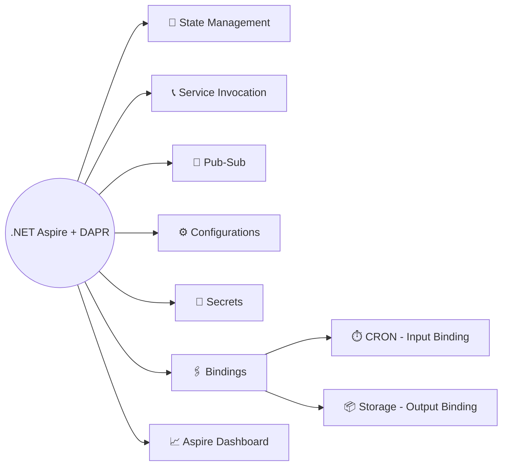

This course is a **cookbook for modern .NET developers**.  
Each chapter is a recipe that teaches a core concept of **cloud‑native, distributed systems** using **.NET Aspire** and **DAPR**.  
Instead of full demo applications with extra boilerplate, we’ll use **simple service examples** — like *ServiceA* and *ServiceB* — to keep the focus on the building blocks themselves.

> Feel free to take the course in order, or jump directly to the building block you are interested in.

---

## ⚡ What is Aspire

**.NET Aspire** is Microsoft’s framework for building **cloud‑native applications**.

You can think of it as *Docker‑Compose, but better* — it not only orchestrates services, but also adds built‑in support for configuration, observability, and deployment, making distributed application design smoother and more consistent.

---

## 🔹 What is DAPR

**DAPR (Distributed Application Runtime)**, as the name suggests, provides **building blocks for distributed systems** — state management, pub‑sub messaging, service invocation, bindings, and secrets.

It abstracts away infrastructure details so you can focus on designing resilient systems without reinventing the plumbing.

---

> 👉 Together, `Aspire` and `DAPR` are the **ingredients** of this course.
By combining them, you’ll learn how to assemble scalable, future‑ready .NET systems step by step.

---

## What to expect from this course

By working through these recipes, you will have:

- A clear understanding of **.NET Aspire** and how it simplifies cloud‑native application design.
- Practical knowledge of **DAPR building blocks** for distributed systems.
- The ability to combine these tools into **scalable, resilient architectures** without boilerplate distractions.
- A structured mental model — a **cookbook of patterns** — that you can apply directly to your own projects.
