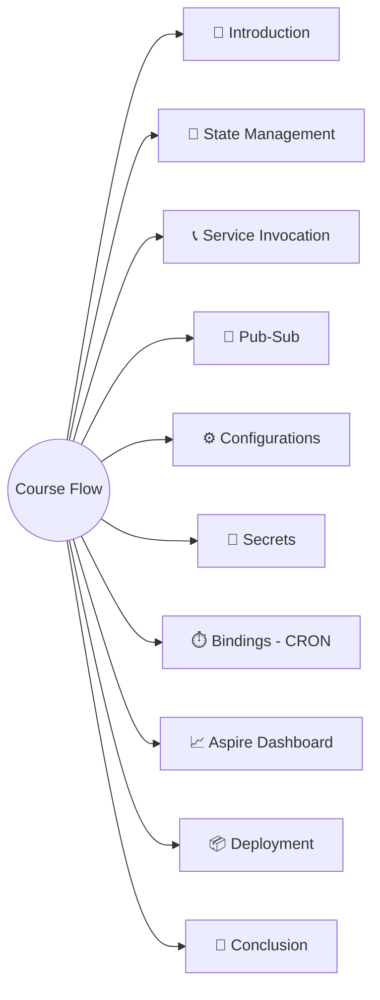

```mermaid
flowchart LR
    root((Course Flow))
    intro[📘 Introduction]
    sm[📒 State Management]
    si[📞 Service Invocation]
    ps[📨 Pub‑Sub]
    cfg[⚙️ Configurations]
    sec[🔐 Secrets]
    bind[⏱️ Bindings - CRON]
    dash[📈 Aspire Dashboard]
    dep[📦 Deployment]
    concl[🚢 Conclusion]

    root --> intro
    root --> sm
    root --> si
    root --> ps
    root --> cfg
    root --> sec
    root --> bind
    root --> dash
    root --> dep
    root --> concl

    click intro "/courses/dapr-aspire/introduction/" "Go to Introduction"
    click sm "/courses/dapr-aspire/state-management/" "Go to State Management"
    click si "/courses/dapr-aspire/service-invocation/" "Go to Service Invocation"
    click ps "/courses/dapr-aspire/pub-sub/" "Go to Pub-Sub"
    click cfg "/courses/dapr-aspire/configurations/" "Go to Configurations"
    click sec "/courses/dapr-aspire/secrets/" "Go to Secrets"
    click bind "/courses/dapr-aspire/bindings/" "Go to Bindings - CRON"
    click dash "/courses/dapr-aspire/aspire-dashboard/" "Go to Aspire Dashboard"
    click dep "/courses/dapr-aspire/deployment/" "Go to Deployment"
    click concl "/courses/dapr-aspire/conclusion/" "Go to Conclusion"
```
