This course teaches you how to design scalable, cloud‑native distributed systems in .NET using `Aspire` and `DAPR`.  
We use minimal service examples to keep the focus on essentials, not boilerplate.  
By the end of the course, you’ll understand `Aspire`’s orchestration capabilities, `DAPR`’s runtime building blocks, and how to combine them into robust, production‑ready architectures.  
You can follow the course step by step or jump directly to the topics most relevant to your work.

## Prerequisites

To follow along comfortably, you’re expected to have the following installed and some basic knowledge:

1. A compatible IDE such as **`Visual Studio 2026`** (recommended), `JetBrains Rider`, or `VS Code` with the `C# Dev Kit` extension  
2. `Docker` or `Podman` installed and running locally  
3. Basic familiarity with `PowerShell` or `Bash` command line environments  
4. Working knowledge of `C#` and `ASP.NET Core` development  

```mermaid
flowchart LR
    root((.NET Aspire + DAPR))
    sm[📒 State Management]
    im-ss[In-Memory State Store]
    redis-ss[Redis State Store]
    si[📞 Service Invocation]
    ps[📨 Pub‑Sub]
    redis-ps[Redis Pub-Sub]
    rabbit-ps[🐇 RabbitMQ Pub-Sub]
    cfg[⚙️ Configurations]
    redis-cfg[ Redis Config Store]
    sec[🔐 Secrets]
    json-sec[Local JSON File]
    env-sec[Environment Variables]
    bind[🖇️  Bindings]
    cron[⏱️ CRON - Input Binding]
    store[📦 Storage - Output Binding]

    root --> sm
    sm --> im-ss
    sm --> redis-ss
    root --> si
    root --> ps
    ps --> redis-ps
    ps --> rabbit-ps
    root --> cfg
    cfg --> redis-cfg
    root --> sec
    sec --> json-sec
    sec --> env-sec
    root --> bind
    bind --> cron
    bind --> store

    click sm "/courses/dapr-aspire/state-management/" "Go to State Management"
    click im-ss "/courses/dapr-aspire/state-management/#in-memory-state-store" "Go to In-Memory State Management"
    click redis-ss "/courses/dapr-aspire/state-management/#redis-state-store" "Go to Redis State Management"
    click si "/courses/dapr-aspire/service-invocation/" "Go to Service Invocation"
    click ps "/courses/dapr-aspire/pub-sub/" "Go to Pub-Sub"
    click redis-ps "/courses/dapr-aspire/pub-sub/#4-configure-pub-sub-component-redis" "Go to Redis Pub-Sub"
    click rabbit-ps "/courses/dapr-aspire/pub-sub/#switching-to-rabbitmq" "Go to RabbitMQ Pub-Sub"
    click cfg "/courses/dapr-aspire/configurations/" "Go to Configurations"
    click redis-cfg "/courses/dapr-aspire/configurations/#redis-configuration" "Go to Redis Configurations"
    click sec "/courses/dapr-aspire/secrets/" "Go to Secrets"
    click json-sec "/courses/dapr-aspire/secrets/#local-json-file" "Go to Local JSON Files"
    click env-sec "/courses/dapr-aspire/secrets/#environment-variable-secret-store" "Go to Environment Variables"
    click bind "/courses/dapr-aspire/bindings/" "Go to Bindings"
    click cron "/courses/dapr-aspire/bindings/#cron-input-binding" "Go to Bindings - CRON"
    click store "/courses/dapr-aspire/bindings/#local-storage-output-binding" "Go to Bindings - Storage"
```



---

## ⚡ `Aspire`

**.NET Aspire** is Microsoft’s framework for building **cloud-native applications**.

Think of it as *Docker Compose, but better* — not only orchestrating services, but also providing built-in support for configuration, observability, and deployment.  
`Aspire` helps make distributed application design smoother, more consistent, and more productive.

### `Aspire` Installation

```sh
dotnet tool install -g aspire.cli
```

Verify with installed `aspire` version

```sh
aspire --version
```

---

## 🔹 `DAPR`

**DAPR (Distributed Application Runtime)** provides a set of **building blocks for distributed systems** — including state management, pub-sub messaging, service invocation, bindings, and secrets.

It abstracts away infrastructure complexity, so you can focus on designing resilient and scalable systems without reinventing the plumbing.

### `DAPR` Installation

> Make sure `Docker` / `Podman` is running, when installing and using `DAPR`

Please refer `DAPR` documentation, for [installation](https://docs.dapr.io/getting-started/install-dapr-cli/) based on your OS.

Verify with installed `DAPR` version

```sh
dapr --version
```

---

> 👉 Together, `Aspire` and `DAPR` form the **ingredients** of this course.
> By combining them, you’ll learn how to assemble scalable, future-ready .NET systems — one recipe at a time.

---

## What to Expect from This Course

By working through these recipes, you will:

- Gain a clear understanding of **.NET Aspire** and how it simplifies cloud-native application design.  
- Acquire practical knowledge of core **DAPR building blocks** for distributed systems.  
- Learn to combine these tools into **scalable, resilient architectures** without boilerplate distractions.  
- Develop a structured mental model — a **cookbook of patterns** — you can apply directly to your own projects.

---
