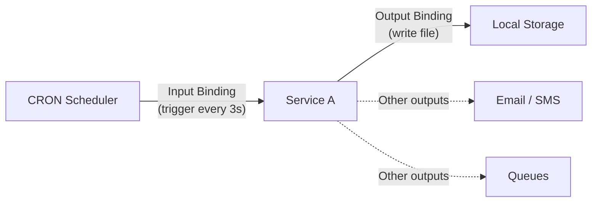
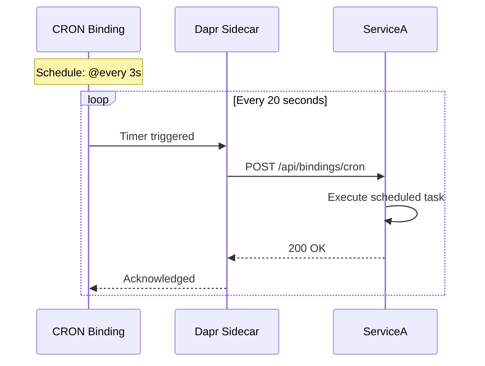
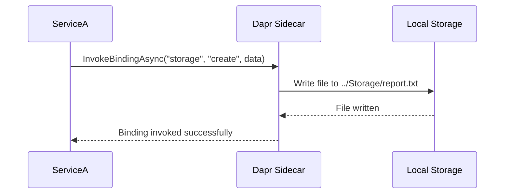

This article shows how to use `Bindings` with `DAPR`'s building block, combined with `.NET Aspire` for orchestration.

You'll learn how services can interact with external systems through input bindings (receiving events) and output bindings (triggering actions) in a distributed environment, with `Aspire` managing the setup and `DAPR` providing the abstraction for various binding types.




---

## Resources

### 👩‍💻 Source Code

If you are stuck, you can refer the final source code, available at [GitHub Repository](https://github.com/NetRecipes/bindings)

## What are Bindings, and Why Do They Matter?

Bindings are `DAPR`'s way of connecting your services to external systems without writing infrastructure-specific code.

In distributed systems, services constantly interact with the outside world — scheduled jobs need to run periodically, files need to be written to storage, emails need to be sent, and messages need to be queued.  
Without proper abstractions, your code becomes tightly coupled to specific SDKs, libraries, and cloud providers.

**Traditional approaches and their problems:**

- **Direct SDK Usage**: Import AWS SDK for S3, Azure SDK for Blob Storage, Google SDK for GCS ❌ different APIs for each provider
- **Scheduled Jobs**: Use Hangfire, Quartz.NET, or cloud-specific schedulers ❌ complex setup and infrastructure dependencies
- **Messaging**: Direct integration with RabbitMQ, Kafka, or service-specific clients ❌ vendor lock-in
- **Event Triggers**: Custom webhook handlers and polling mechanisms ❌ boilerplate code for each integration

`DAPR`'s Bindings solve this with two types:

### **Input Bindings** (events coming INTO your service):

- CRON schedules trigger your service at specific intervals
- Kafka messages arrive and invoke your endpoints
- AWS SQS queues deliver messages

## **Output Bindings** (actions going OUT from your service):

- Write files to local storage, S3, Azure Blob
- Send emails via SendGrid, Twilio
- Post messages to Kafka, RabbitMQ, AWS SNS
- Invoke external HTTP endpoints

For example, think of a reporting service that needs to:

- Run every night at 2 AM to generate reports (Input Binding: CRON)
- Save reports to cloud storage (Output Binding: Storage)
- Send email notifications (Output Binding: Email)
- Post completion status to a queue (Output Binding: Message Queue)

With DAPR's Bindings:
- `ServiceA` receives CRON triggers without a job scheduler library
- DAPR invokes your service at scheduled intervals
- Your service uses output bindings to write files, send emails, etc.
- Switch storage providers (local → S3 → Azure Blob) with just configuration

## Hands-On Setup

We'll scaffold a new .NET Aspire solution and add a simple Web API service that uses both input and output bindings.

Each command below is shown individually with its purpose explained.

### 1. Create the Aspire host project

This sets up the orchestration project named `Bindings`.

```bash
dotnet new aspire --name Bindings --no-https --output .
```

### 2. Create the Web API service

Generates a Web API project called `ServiceA` using controllers.

```bash
dotnet new webapi --name ServiceA --no-https --use-controllers
```

### 3. Add the service to the solution

Registers `ServiceA` into the solution so it's managed by Aspire.

```bash
dotnet sln add .\ServiceA\
```

### 4. Migrate to the new `.slnx` format (Optional)

Converts the solution to the modern format used by Aspire.

And cleans up the legacy solution file, leaving only `Bindings.slnx`.

```bash
dotnet sln migrate
rm Bindings.sln
```

> 💡 **Note:** The newer `.slnx` solution format is a general .NET enhancement. It's cleaner and more minimal than the traditional `.sln`, reducing boilerplate and making solutions easier to manage in modern .NET projects.

Now, open `Bindings.slnx` with `Visual Studio` or `Rider`, or simply open the directory with `VS Code`.

Alternatively, you can skip these steps and clone the final companion repository: [NetRecipes/bindings](https://github.com/NetRecipes/bindings).

## NuGet Packages

Depending on your IDE, install the following NuGet packages in the specified projects:

### ServiceA

In the `ServiceA` project, install the following NuGet packages to enable DAPR integration, API documentation, and UI enhancements.

(Note: `Microsoft.AspNetCore.OpenApi` is usually included by default in the Web API template, so you may not need to install it separately.)

| Package ID | Purpose |
|------------|---------|
| [Dapr.AspNetCore](https://www.nuget.org/packages/Dapr.AspNetCore) | Enables DAPR integration for ASP.NET Core services, including bindings, state management, and pub/sub. |
| [Swashbuckle.AspNetCore.SwaggerUI](https://www.nuget.org/packages/Swashbuckle.AspNetCore.SwaggerUI) | Provides an interactive API documentation interface. |
| [AspNetCore.SwaggerUI.Themes](https://www.nuget.org/packages/AspNetCore.SwaggerUI.Themes) | Offers modern UI themes for Swagger documentation. |

```bash
dotnet add ServiceA package Dapr.AspNetCore
dotnet add ServiceA package Swashbuckle.AspNetCore
dotnet add ServiceA package Swashbuckle.AspNetCore.SwaggerUI
dotnet add ServiceA package AspNetCore.SwaggerUI.Themes
```

### Bindings.AppHost

In the `Bindings.AppHost` project, install the following NuGet packages to enable integration with DAPR sidecars.

| Package ID | Purpose |
|------------|---------|
| [CommunityToolkit.Aspire.Hosting.Dapr](https://www.nuget.org/packages/CommunityToolkit.Aspire.Hosting.Dapr) | Integrates DAPR sidecars into an Aspire application, enabling service orchestration with DAPR building blocks. |

```bash
dotnet add Bindings.AppHost package CommunityToolkit.Aspire.Hosting.Dapr
```

## Code Walkthrough

With the setup complete, let's implement both input and output bindings in `ServiceA`.

### 1. Program.cs – Add DAPR support

In `ServiceA/Program.cs`, register DAPR services and Swagger UI:

```csharp
using AspNetCore.Swagger.Themes;

var builder = WebApplication.CreateBuilder(args);

builder.AddServiceDefaults(); // Aspire hosting helpers
builder.Services.AddDaprClient(); // Enables DAPR integration
builder.Services.AddControllers().AddDapr(); // Adds DAPR support to controllers
builder.Services.AddOpenApi();

var app = builder.Build();

if (app.Environment.IsDevelopment())
{
    app.MapOpenApi();
    app.UseSwaggerUI(Theme.Futuristic);
}

app.UseAuthorization();
app.UseCloudEvents();
app.MapControllers();
app.MapSubscribeHandler();

app.Run();
```

### 2. BindingsController.cs – Handle input and output bindings

Create a controller `Controllers/BindingsController.cs` to demonstrate both binding types.

```csharp
[Route("api/[controller]")]
[ApiController]
public class BindingsController(
    DaprClient daprClient,
    ILogger<BindingsController> logger) : ControllerBase
{
}
```

#### Input Binding - CRON Scheduler

Input bindings receive events from external systems. Here, CRON will trigger this endpoint every `x` seconds, where `x` can be configured.

```csharp
[HttpPost("cron")]
public IActionResult CronTrigger()
{
    logger.LogInformation("CRON triggered at {Time}", DateTime.UtcNow);
    
    // Perform scheduled task here
    // Examples: generate reports, cleanup old data, send notifications
    
    return Ok(new { message = "CRON job executed", timestamp = DateTime.UtcNow });
}
```

#### **Key points about input bindings:**

- `DAPR` invokes this endpoint based on the CRON schedule
- Your service doesn't need a job scheduling library
- The route must match the `route` metadata in the component configuration
- Return `200 OK` to acknowledge successful processing

### Output Binding - Local Storage

Output bindings send data to external systems. Here, we'll write files to local storage.

```csharp
[HttpPost("upload")]
[Consumes(MediaTypeNames.Multipart.FormData)]
public async Task<IActionResult> Upload([FromForm] UploadRequest request)
{
    var file = request.File;

    if (file == null || file.Length ==0)
    {
        logger.LogError("No file uploaded");
        return BadRequest();
    }

    byte[] fileBytes;
    using (var ms = new MemoryStream())
    {
        await file.CopyToAsync(ms);
        fileBytes = ms.ToArray();
    }

    var fileName = $"{Guid.NewGuid()}{Path.GetExtension(file.FileName)}";

    Dictionary<string, string> metadata = new()
    {
        { "fileName", fileName },
        { "blobName", fileName }
    };

    await daprClient.InvokeBindingAsync(
        "storage",
        "create",
        fileBytes,
        metadata);

    return Ok(fileName);
}
```

The `UploadRequest` model can be defined as:

```csharp
using System.ComponentModel.DataAnnotations;

namespace ServiceA;

public class UploadRequest
{
    [Required]
    public IFormFile File { get; set; }
}
```

#### **Key points about output bindings:**

- `InvokeBindingAsync` sends data to the configured binding
- `"storage"` is the binding component name
- `"create"` is the operation (other operations: `get`, `delete`, `list`)
- Metadata provides additional parameters like file name

### 3. Configure Bindings in AppHost

In `Bindings.AppHost/Program.cs`, configure the service with DAPR sidecar:

```csharp
using CommunityToolkit.Aspire.Hosting.Dapr;

var builder = DistributedApplication.CreateBuilder(args);

var servicea = builder
    .AddProject<Projects.ServiceA>("service-a")
    .WithExternalHttpEndpoints()
    .WithDaprSidecar(new DaprSidecarOptions
    {
        ResourcesPaths = [Path.Combine("..", "components")]
    });

builder.Build().Run();
```

## CRON Input Binding

### Configure the CRON Component

Create a `components` folder at the solution root and add a `cron.yaml` file:

`components/cron.yaml`

```yaml
apiVersion: dapr.io/v1alpha1
kind: Component
metadata:
  name: scheduler
  namespace: default
spec:
  type: bindings.cron
  version: v1
  metadata:
  - name: schedule
    value: "@every 3s"
  - name: route
    value: /api/bindings/cron
```

#### **Component details (CRON):**

- `type: bindings.cron` - Uses CRON scheduling for input binding
- `schedule` - CRON expression (`@every 3s`, `@hourly`, `0 2 * * *` for 2 AM daily)
- `route` - The endpoint DAPR will invoke when the schedule triggers

### Running with CRON Binding

Now, when you run your setup, you should see the Aspire dashboard with `ServiceA`.


#### **What happens:**

1. DAPR loads the CRON binding configuration
2. Every 20 seconds, DAPR invokes `POST /api/bindings/cron` on `ServiceA`
3. Your controller method executes
4. Check the logs to see periodic executions

You'll see log entries


## Local Storage Output Binding

### Create Storage Directory

Create a folder named `Storage` at the solution root. This is where files will be written.

### Configure the Storage Component

In the `components` folder, add a `storage.yaml` file:

`components/storage.yaml`

```yaml
apiVersion: dapr.io/v1alpha1
kind: Component
metadata:
  name: storage
spec:
  type: bindings.localstorage
  version: v1
  metadata:
  - name: rootPath
    value: "../Storage"
```

#### **Component details (Storage):**

- `type: bindings.localstorage` - Uses local file system for output binding
- `rootPath` - Directory where files will be stored

### Testing Output Binding

1. Visit `ServiceA`'s Swagger endpoint, with `/swagger` at the end of the URL
1. Call the `/api/bindings/upload` endpoint with by uploading a file
    
1. Check the `Storage` folder — you'll see `report.txt` created with the content


| Upload | Download |
| --- | --- |
|  |  |

## What's Happening Behind the Scenes

### Input Binding Flow

When using CRON input binding:

1. `DAPR` sidecar loads the `cron.yaml` component
2. `DAPR`'s CRON binding starts the schedule timer
3. Every `x` seconds, DAPR creates an HTTP POST request
4. DAPR invokes `ServiceA` at the configured route
5. Your controller processes the request
6. `DAPR` waits for the next scheduled time



### Output Binding Flow

When using storage output binding:

1. `ServiceA` calls `daprClient.InvokeBindingAsync`
2. `DAPR` sidecar receives the binding invocation
3. `DAPR` reads the `storage.yaml` component configuration
4. `DAPR`'s local storage binding writes the file
5. File appears in the `Storage` directory



## Bindings Benefits

By using `DAPR` for bindings, you get several advantages:

| Benefits | Description |
|----------|-------------|
| **Decoupled Infrastructure** | Services don't import cloud-specific SDKs. Switch from local storage to S3 to Azure Blob with just configuration. |
| **Simplified Scheduling** | No need for Hangfire, Quartz, or cloud schedulers. CRON bindings handle periodic tasks with simple configuration. |
| **Consistent API** | Same `DAPR` API for all external integrations. Write once, switch backends without code changes. |
| **Reduced Dependencies** | No need to manage multiple SDKs, client libraries, or authentication mechanisms. `DAPR` handles it all. |
| **Testability** | Mock bindings easily in tests. Input bindings are just HTTP endpoints. Output bindings can use in-memory implementations. |
| **Portability** | Run locally with file storage, deploy to cloud with managed services. Zero service code changes. |

## Flexibility

Switch between `DAPR` supported [Bindings](https://docs.dapr.io/reference/components-reference/supported-bindings/) without changing service code. `DAPR` abstracts the integration layer.

The pattern is consistent:
- No service code changes
- No NuGet package changes
- Just component configuration

Start with local file storage and CRON for development, switch to cloud services for production.

## Summary

With `DAPR` and Aspire, you can build services that interact with external systems without coupling your code to specific SDKs or cloud providers.

Input bindings let external events trigger your services, while output bindings let your services trigger external actions. Whether you're scheduling tasks with CRON, writing files to storage, sending emails, or integrating with message queues, `DAPR` provides a consistent API.

Your service logic stays the same regardless of the underlying infrastructure — thanks to `DAPR`'s abstraction and `Aspire`'s orchestration.
