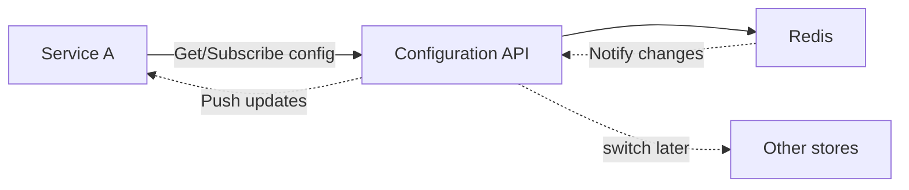
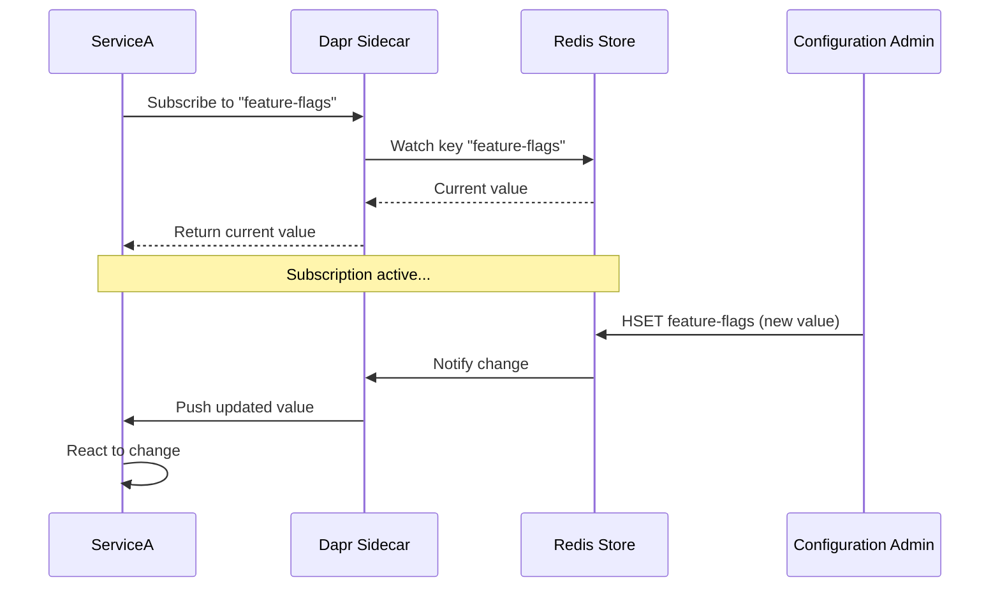

This article shows how to use Configuration Store with `DAPR`'s building block, combined with `.NET Aspire` for orchestration.

You'll learn how services can retrieve and watch configuration changes dynamically in a distributed environment, with `Aspire` managing the setup and `DAPR` providing the abstraction for configuration stores.



---

## Resources

### 👩‍💻 Source Code

If you are stuck, you can refer the final source code, available at [GitHub Repository](https://github.com/NetRecipes/config-store)

## What is Configuration Store, and Why It Matters?

Configuration Store is the ability of an application to retrieve and react to configuration changes without redeployment or restart.

In distributed systems, services often need to adjust behavior based on configuration — feature flags, connection strings, rate limits, or business rules.  
Without proper configuration management, teams resort to hardcoded values, environment variables, or manual restarts for every change.

Traditional configuration approaches have limitations:

- **Environment Variables**: Require restart to change
- **appsettings.json**: Baked into deployment, no runtime updates
- **Hardcoded Values**: Bad practice ❌ requires recompilation

`DAPR`'s Configuration Store solves this by providing a consistent API for reading configuration and subscribing to changes in real-time.

For example, think of an e-commerce system where you need to:

- Toggle a new checkout feature on/off without redeployment
- Adjust rate limiting thresholds based on traffic
- Update promotional discount percentages instantly
- Switch database connection strings during failover

With `DAPR`'s Configuration Store:

- `ServiceA` reads configuration from Redis (or any supported store)
- Configuration changes are pushed to subscribed services in real-time
- Services react to changes without restart
- No service code changes needed to switch configuration backends

> 💡 **Note:** `DAPR` Configuration is distinct from .NET's `IConfiguration`. While .NET configuration is typically static (loaded at startup), `DAPR` Configuration is dynamic — services can subscribe to changes and react in real-time without restart.

## Hands-On Setup

We'll scaffold a new .NET Aspire solution and add a simple Web API service that reads and watches configuration.

Each command below is shown individually with its purpose explained.

### 1. Create the Aspire host project

This sets up the orchestration project named `ConfigStore`.

```bash
dotnet new aspire --name ConfigStore --no-https --output .
```

### 2. Create the Web API service

Generates a Web API project called `ServiceA` using controllers.

```bash
dotnet new webapi --name ServiceA --no-https --use-controllers
```

### 3. Add the service to the solution

Registers `ServiceA` into the solution so it's managed by Aspire.

```bash
dotnet sln add .\ServiceA\
```

### 4. Migrate to the new `.slnx` format (Optional)

Converts the solution to the modern format used by Aspire.

And cleans up the legacy solution file, leaving only `ConfigStore.slnx`.

```bash
dotnet sln migrate
rm ConfigStore.sln
```

> 💡 **Note:** The newer `.slnx` solution format is a general .NET enhancement. It's cleaner and more minimal than the traditional `.sln`, reducing boilerplate and making solutions easier to manage in modern .NET projects.

Now, open `ConfigStore.slnx` with `Visual Studio` or `Rider`, or simply open the directory with `VS Code`.

Alternatively, you can skip these steps and clone the final companion repository: [NetRecipes/config-store](https://github.com/NetRecipes/config-store).

## NuGet Packages

Depending on your IDE, install the following NuGet packages in the specified projects:

### ServiceA

In the `ServiceA` project, install the following NuGet packages to enable DAPR integration, API documentation, and UI enhancements.

(Note: `Microsoft.AspNetCore.OpenApi` is usually included by default in the Web API template, so you may not need to install it separately.)

| Package ID | Purpose |
|------------|---------|
| [Dapr.AspNetCore](https://www.nuget.org/packages/Dapr.AspNetCore) | Integrates DAPR, including configuration, state management, and pub-sub for ASP.NET Core services. |
| [Swashbuckle.AspNetCore.SwaggerUI](https://www.nuget.org/packages/Swashbuckle.AspNetCore.SwaggerUI) | Provides Swagger UI for API documentation and testing. |
| [AspNetCore.SwaggerUI.Themes](https://www.nuget.org/packages/AspNetCore.SwaggerUI.Themes) | Adds modern themes to Swagger UI for better visual experience. |

```bash
dotnet add ServiceA package Dapr.AspNetCore
dotnet add ServiceA package Swashbuckle.AspNetCore
dotnet add ServiceA package Swashbuckle.AspNetCore.SwaggerUI
dotnet add ServiceA package AspNetCore.SwaggerUI.Themes
```

### ConfigStore.AppHost

In the `ConfigStore.AppHost` project, install the following NuGet packages to enable integration with DAPR and configure a Redis configuration store.

| Package ID | Purpose |
|------------|---------|
| [CommunityToolkit.Aspire.Hosting.Dapr](https://www.nuget.org/packages/CommunityToolkit.Aspire.Hosting.Dapr) | Integrates DAPR sidecars into an Aspire application, enabling service orchestration with DAPR building blocks. |
| [Aspire.Hosting.Redis](https://www.nuget.org/packages/Aspire.Hosting.Redis) | Adds Redis container support to Aspire hosting, allowing you to configure Redis as a configuration store. |

```bash
dotnet add ConfigStore.AppHost package CommunityToolkit.Aspire.Hosting.Dapr
dotnet add ConfigStore.AppHost package Aspire.Hosting.Redis
```

## Code Walkthrough

With the setup complete, let's implement configuration management in `ServiceA`.

### 1. Program.cs – Add DAPR support

In `ServiceA/Program.cs`, register DAPR services and Swagger UI:

```csharp
using AspNetCore.Swagger.Themes;

var builder = WebApplication.CreateBuilder(args);

builder.AddServiceDefaults(); // Aspire hosting helpers
builder.Services.AddDaprClient(); // Enables DAPR integration
builder.Services.AddControllers().AddDapr(); // Adds DAPR support to controllers
builder.Services.AddOpenApi();

var app = builder.Build();

if (app.Environment.IsDevelopment())
{
    app.MapOpenApi();
    app.UseSwaggerUI(Theme.Futuristic);
}

app.UseAuthorization();
app.UseCloudEvents();
app.MapControllers();
app.MapSubscribeHandler();

app.Run();
```

### 2. ConfigController.cs – Read and subscribe to configuration

Create a controller `Controllers/ConfigController.cs` to demonstrate reading and watching configuration.

```csharp
[Route("api/[controller]")]
[ApiController]
public class ConfigController(
    DaprClient daprClient,
    ILogger<ConfigController> logger) : ControllerBase
{
}
```

#### Read Configuration

```csharp
[HttpGet("read")]
public async Task<IActionResult> ReadConfig(string key)
{
    var response = await daprClient.GetConfiguration("configstore", [key]);
    if (response.Items.Count == 0)
    {
        return NotFound();
    }

    var value = response.Items[key].Value;
    logger.LogInformation("Reading configuration for {Key}: {Value}", key, value);
        
    return Ok(value);
}
```

Key points about configuration:

- `GetConfiguration` retrieves current values
- `SubscribeConfiguration` watches for changes in real-time
- Multiple keys can be retrieved or watched simultaneously
- Changes are pushed to subscribers without polling

### 3. Configure Configuration Store in AppHost

In `ConfigStore.AppHost/Program.cs`, configure Redis as the configuration store:

```csharp
using CommunityToolkit.Aspire.Hosting.Dapr;

var builder = DistributedApplication.CreateBuilder(args);

var redisPassword = builder.AddParameter("RedisPassword", true);
var redisPort = builder.AddParameter("RedisPort");
var redisPortValue = await redisPort.Resource.GetValueAsync(CancellationToken.None);

var redis = builder
    .AddRedis("redis", int.Parse(redisPortValue!), redisPassword)
    .WithRedisInsight();

var servicea = builder
    .AddProject<Projects.ServiceA>("service-a")
    .WithExternalHttpEndpoints()
    .WaitFor(redis)
    .WithDaprSidecar(new DaprSidecarOptions
    {
        ResourcesPaths = [Path.Combine("..", "components")]
    });

builder.Build().Run();
```

### Redis configuration

You'll need a `components/configstore.yaml` file with the following content:

```yaml
apiVersion: dapr.io/v1alpha1
kind: Component
metadata:
  name: configstore
spec:
  type: configuration.redis
  version: v1
  metadata:
    - name: redisHost
      value: localhost:6500
    - name: redisPassword
      value: "localDev"
```

To pass the Redis credentials, update the `appsettings.Development.json` file in the `ConfigStore.AppHost` project:

```json
{
  "Logging": {
    ...
  },
  "Parameters": {
    "RedisPort": "6500",
    "RedisPassword": "localDev"
  }
}
```

## Running the Application

Now, when you run your setup, you should see the Aspire dashboard with `ServiceA` and Redis.


### Add a configuration

Open `Redis Insight` and add an entry of type String, with key `hello` and value `world`.


### Testing Configuration Retrieval

1. Visit `ServiceA`'s Swagger endpoint, with `/swagger` at the end of the URL
1. Make API Call from `ServiceA`'s endpoint `/api/config/read`, by passing `key` as `hello`
1. You'll see the current configuration value returned


### What's Happening Behind the Scenes

When you retrieve or subscribe to configuration:

1. `ServiceA` requests configuration from its `DAPR` sidecar
2. `DAPR` queries `Redis` for the requested keys
3. For subscriptions, DAPR watches `Redis` for changes
4. When configuration changes in `Redis`, `DAPR` pushes updates to subscribers
5. `ServiceA` receives updates and can react immediately



All of this happens with minimal latency and without service restart.

## Configuration Store Benefits

By using DAPR for configuration, you get several advantages:

| Benefits | Description |
| --- | --- |
| `Dynamic Updates` | Configuration changes take effect immediately without restarting services. Update feature flags, rate limits, or business rules in real-time. |
| `Consistent API` | Same DAPR API regardless of backend store. Switch from Redis to Azure App Configuration or other stores without code changes. |
| `Real-Time Notifications` | Services receive push notifications when configuration changes, eliminating polling and reducing latency. |
| `Multi-Key Operations` | Retrieve or watch multiple configuration keys in a single operation, improving efficiency. |
| `Simplified Testing` | No special configuration infrastructure needed for integration testing. Since DAPR exposes configuration via standard APIs, testing is straightforward. |

### Flexibility

Switch between `DAPR` supported [Configuration Stores](https://docs.dapr.io/reference/components-reference/supported-configuration-stores/) without changing service code. `DAPR` abstracts the configuration layer.

## Summary

With `DAPR` and `Aspire`, you can build services that adapt to configuration changes in real-time without restart.  
Whether you're managing feature flags, rate limits, or connection strings, `DAPR` provides a consistent API regardless of the backing store.  
Services can react to configuration changes instantly, making your system more flexible and easier to operate — thanks to `DAPR`'s abstraction and `Aspire`'s orchestration.
