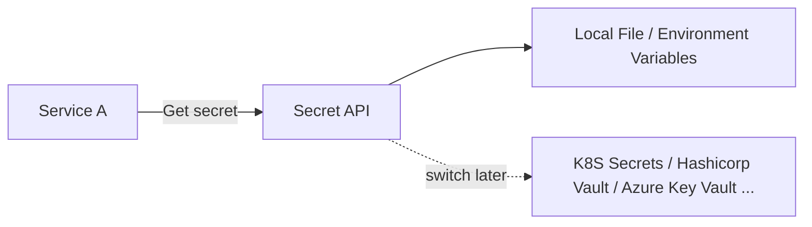
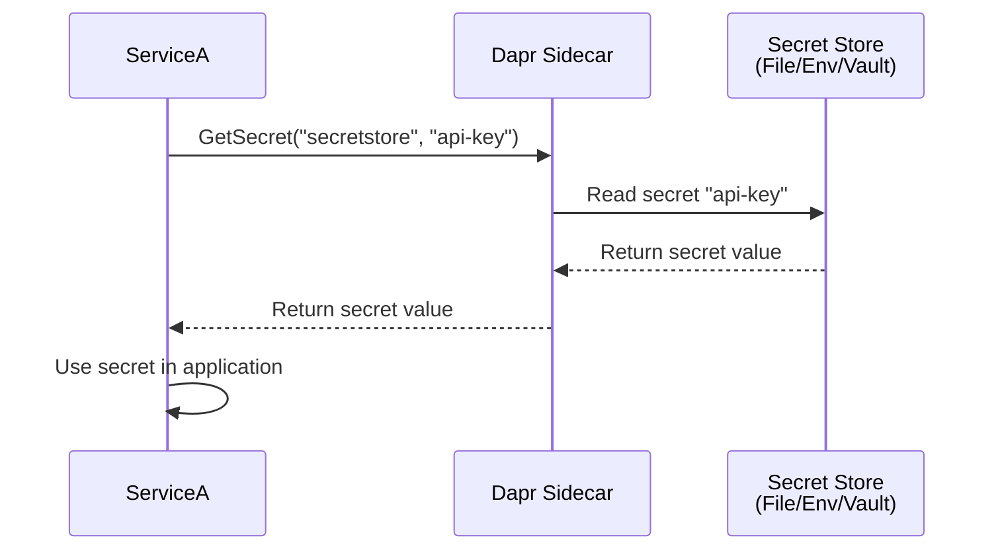

This article shows how to use **Secret Store** with `DAPR`'s building block, combined with `.NET Aspire` for orchestration.

You'll learn how services can securely retrieve sensitive information like API keys, connection strings, and passwords in a distributed environment, with `Aspire` managing the setup and `DAPR` providing the abstraction for secret stores.



---

## Resources

### 👩‍💻 Source Code

If you are stuck, you can refer the final source code, available at [GitHub Repository](https://github.com/NetRecipes/secret-store)

## What is Secret Store, and Why It Matters?

Secret Store is the ability of an application to retrieve sensitive information securely without hardcoding credentials or exposing them in configuration files.

In distributed systems, services need access to sensitive data like API keys, database passwords, connection strings, and certificates.  
Without proper secret management, teams often resort to dangerous practices that expose systems to security risks.

**Common anti-patterns and their risks:**

- **Hardcoded secrets**: Embedded directly in source code ❌ exposed in version control
- **Plain text config files**: Stored in `appsettings.json` ❌ committed to repositories
- **Environment variables everywhere**: Scattered across deployment configs ❌ hard to rotate and manage
- **Secrets in CI/CD logs**: Accidentally printed during builds ❌ visible in build outputs

`DAPR`'s Secret Store solves this by providing a consistent API for reading secrets from various backends, while keeping the actual secrets isolated from your application code.

For example, think of a payment processing service that needs:

- Payment gateway API keys
- Database connection strings  
- JWT signing certificates
- Third-party service tokens

With `DAPR`'s Secret Store:

- `ServiceA` requests secrets from `DAPR` without knowing where they're stored
- `DAPR` retrieves secrets from the configured backend (local file, Kubernetes, Azure Key Vault, etc.)
- Secrets are injected at runtime, never hardcoded
- Switch secret stores without changing service code

> 💡 **Note:** This article demonstrates local secret stores for development. In production, you'd use managed services like Azure Key Vault, AWS Secrets Manager, or Kubernetes Secrets.

## Hands-On Setup

We'll scaffold a new `.NET Aspire` solution and add a simple Web API service that retrieves secrets securely.

Each command below is shown individually with its purpose explained.

### 1. Create the Aspire host project

This sets up the orchestration project named `SecretStore`.

```bash
dotnet new aspire --name SecretStore --no-https --output .
```

### 2. Create the Web API service

Generates a Web API project called `ServiceA` using controllers.

```bash
dotnet new webapi --name ServiceA --no-https --use-controllers
```

### 3. Add the service to the solution

Registers `ServiceA` into the solution so it's managed by Aspire.

```bash
dotnet sln add .\ServiceA\
```

### 4. Migrate to the new `.slnx` format (Optional)

Converts the solution to the modern format used by Aspire.

And cleans up the legacy solution file, leaving only `SecretStore.slnx`.

```bash
dotnet sln migrate
rm SecretStore.sln
```

> 💡 **Note:** The newer `.slnx` solution format is a general .NET enhancement. It's cleaner and more minimal than the traditional `.sln`, reducing boilerplate and making solutions easier to manage in modern .NET projects.

Now, open `SecretStore.slnx` with `Visual Studio` or `Rider`, or simply open the directory with `VS Code`.

Alternatively, you can skip these steps and clone the final companion repository: [NetRecipes/secret-store](https://github.com/NetRecipes/secret-store).

## NuGet Packages

Depending on your IDE, install the following NuGet packages in the specified projects:

### ServiceA

In the `ServiceA` project, install the following NuGet packages to enable DAPR integration, API documentation, and UI enhancements.

(Note: `Microsoft.AspNetCore.OpenApi` is usually included by default in the Web API template, so you may not need to install it separately.)

| Package ID | Purpose |
|------------|---------|
| [Dapr.AspNetCore](https://www.nuget.org/packages/Dapr.AspNetCore) | Enables DAPR integration for ASP.NET Core services, including secrets, state management, and pub/sub. |
| [Swashbuckle.AspNetCore.SwaggerUI](https://www.nuget.org/packages/Swashbuckle.AspNetCore.SwaggerUI) | Provides an interactive API documentation interface. |
| [AspNetCore.SwaggerUI.Themes](https://www.nuget.org/packages/AspNetCore.SwaggerUI.Themes) | Offers modern UI themes for Swagger documentation. |

```bash
dotnet add ServiceA package Dapr.AspNetCore
dotnet add ServiceA package Swashbuckle.AspNetCore
dotnet add ServiceA package Swashbuckle.AspNetCore.SwaggerUI
dotnet add ServiceA package AspNetCore.SwaggerUI.Themes
```

### SecretStore.AppHost

In the `SecretStore.AppHost` project, install the following NuGet packages to enable integration with `DAPR` sidecars.

| Package ID | Purpose |
|------------|---------|
| [CommunityToolkit.Aspire.Hosting.Dapr](https://www.nuget.org/packages/CommunityToolkit.Aspire.Hosting.Dapr) | Integrates `DAPR` sidecars into an Aspire application, enabling service orchestration with DAPR building blocks. |

```bash
dotnet add SecretStore.AppHost package CommunityToolkit.Aspire.Hosting.Dapr
```

## Code Walkthrough

With the setup complete, let's implement secret retrieval in `ServiceA`.

### 1. Program.cs – Add DAPR support

In `ServiceA/Program.cs`, register DAPR services and Swagger UI:

```csharp
using AspNetCore.Swagger.Themes;

var builder = WebApplication.CreateBuilder(args);

builder.AddServiceDefaults(); // Aspire hosting helpers
builder.Services.AddDaprClient(); // Enables DAPR integration
builder.Services.AddControllers().AddDapr(); // Adds DAPR support to controllers
builder.Services.AddOpenApi();

var app = builder.Build();

if (app.Environment.IsDevelopment())
{
    app.MapOpenApi();
    app.UseSwaggerUI(Theme.Futuristic);
}

app.UseAuthorization();
app.UseCloudEvents();
app.MapControllers();
app.MapSubscribeHandler();

app.Run();
```

### 2. SecretController.cs – Retrieve secrets

Create a controller `Controllers/SecretController.cs` to demonstrate retrieving secrets securely.

```csharp
[Route("api/[controller]")]
[ApiController]
public class SecretController(
    DaprClient daprClient,
    ILogger<SecretController> logger) : ControllerBase
{
}
```

#### Get a Single Secret

```csharp
[HttpGet("single")]
public async Task<IActionResult> GetSecret(string key)
{
    var secrets = await daprClient.GetSecretAsync("secretstore", key);
    
    if (secrets.Count == 0)
    {
        return NotFound();
    }

    var secretValue = secrets[key];
    
    logger.LogInformation("Successfully retrieved secret for key: {Key}", key);
    
    // In real applications, NEVER log secret values
    // This is for demonstration only
    return Ok(new { key, value = secretValue });
}
```

#### **Key points about secrets:**

- `GetSecretAsync` retrieves secrets from `DAPR`'s secret store component
- The method returns a dictionary where the key is the secret name
- Never log actual secret values in production
- Handle missing secrets gracefully with proper error handling
- Secret retrieval happens at runtime, not compile time

### 3. Configure Secret Store in AppHost

In `SecretStore.AppHost/Program.cs`, configure the service with DAPR sidecar:

```csharp
using CommunityToolkit.Aspire.Hosting.Dapr;

var builder = DistributedApplication.CreateBuilder(args);

var servicea = builder
    .AddProject<Projects.ServiceA>("service-a")
    .WithExternalHttpEndpoints()
    .WithDaprSidecar(new DaprSidecarOptions
    {
        ResourcesPaths = [Path.Combine("..", "components")]
    });

builder.Build().Run();
```

## Local JSON File

### Create the Secrets File

Create a folder named `SecretsStore` at the solution root and add a `secrets.json` file:

```json
{
    "Hello": "World!",
    "Spiderman": "Peter Parker",
    "Lorem": "Ipsum"
}
```

> 🚨 **Note:** This file should **NEVER** be committed to version control. Add it to `.gitignore` immediately.

### Configure the Component

Create a `components` folder at the solution root and add a `secretstore.yaml` file:

```yaml
apiVersion: dapr.io/v1alpha1
kind: Component
metadata:
  name: secretstore
  namespace: default
spec:
  type: secretstores.local.file
  version: v1
  metadata:
    - name: secretsFile
      value: ../SecretsStore/secrets.json
    - name: nestedSeparator
      value: ":"
```

#### **Component details:**

- `type: secretstores.local.file` - Uses local JSON file for secrets
- `secretsFile` - Path to the JSON file containing secrets
- `nestedSeparator` - Allows nested secret access like `database:password`

### Running with File-Based Secrets

Now, when you run your setup, you should see the `Aspire` dashboard with `ServiceA`.


#### Testing Secret Retrieval

1. Visit `ServiceA`'s Swagger endpoint, with `/swagger` at the end of the URL
2. Call the `/api/Secrets/read` endpoint with `key=Spiderman`
3. You'll see the secret value returned from the JSON file


> Secrets must be kept secret


## Environment Variable Secret Store

For even simpler local development, you can use environment variables as your secret store.

### Configure Environment Variables

You can set environment variables in multiple ways, for simplicity, we'll set directly in AppHost's `launchSettings.json` file

```json
{
  "$schema": "https://json.schemastore.org/launchsettings.json",
  "profiles": {
    "http": {
      "commandName": "Project",
      "dotnetRunMessages": true,
      "launchBrowser": true,
      "applicationUrl": "http://localhost:15214",
      "environmentVariables": {
        "ASPNETCORE_ENVIRONMENT": "Development",
        "DOTNET_ENVIRONMENT": "Development",
        ...
        "Hello": "World" // Set here
      }
    }
  }
}
```

### Update the Component Configuration

Replace the contents of `components/secretstore.yaml`:

```yaml
apiVersion: dapr.io/v1alpha1
kind: Component
metadata:
  name: secretstore
  namespace: default
spec:
  type: secretstores.local.env
  version: v1
  metadata:
```

#### **Component details:**

- `type: secretstores.local.env` - Uses environment variables as the secret store
- No additional metadata needed - DAPR automatically reads from the environment

### Running with Environment Variable Secrets

Run the application again. When you call the `/api/Secrets/read` endpoint with `key=Hello`, you'll get the value from the environment variable.

#### **Key differences:**

- Secret keys in environment variables use underscores: `API_KEY`, `JWT_SECRET`
- In the JSON file, you could use hyphens: `api-key`, `jwt-secret`
- Environment variables are simpler but less organized for many secrets

## What's Happening Behind the Scenes

When you retrieve a secret:

1. `ServiceA` requests a secret from its `DAPR` sidecar
2. `DAPR` reads the secret store component configuration
3. Based on the `type`, `DAPR` retrieves the secret from the appropriate backend
4. The secret value is returned to `ServiceA`
5. Your service uses the secret without knowing where it came from



All of this happens securely with the secret store abstracted behind `DAPR`'s API.

## Secret Store Benefits

By using `DAPR` for secrets, you get several advantages:

| Benefits | Description |
|----------|-------------|
| **Security** | Secrets are never hardcoded or committed to version control. They're retrieved at runtime from secure stores. |
| **Consistent API** | Same `DAPR` API regardless of backend. Retrieve secrets the same way whether using local files, environment variables, or cloud vaults. |
| **Easy Rotation** | Update secrets in the store without redeploying services. Services retrieve the latest values on each request. |
| **Separation of Concerns** | Developers work with secret keys, not values. Operations teams manage actual secrets in secure stores. |
| **Simplified Testing** | Use local file or environment stores for development. Switch to secure vaults in production with just configuration changes. |
| **Reduced Attack Surface** | Secrets are not scattered across config files, deployment scripts, and CI/CD pipelines. |

## Flexibility

Switch between `DAPR` supported [Secret Stores](https://docs.dapr.io/reference/components-reference/supported-secret-stores/) without changing service code. `DAPR` abstracts the secret management layer.

Just like with state stores and configuration stores, the power of abstraction means:

- No service code changes
- No NuGet package changes  
- Just component configuration

Start with local files for development, graduate to managed vaults for production.

## Summary

With `DAPR` and Aspire, you can build services that handle secrets securely without hardcoding sensitive information.

Whether you're using local files for development or Azure Key Vault for production, `DAPR` provides a consistent API that keeps your services secure and maintainable.

Your application code stays the same regardless of where secrets are stored — thanks to `DAPR`'s abstraction and `Aspire`'s orchestration.
