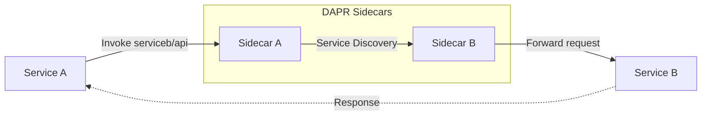
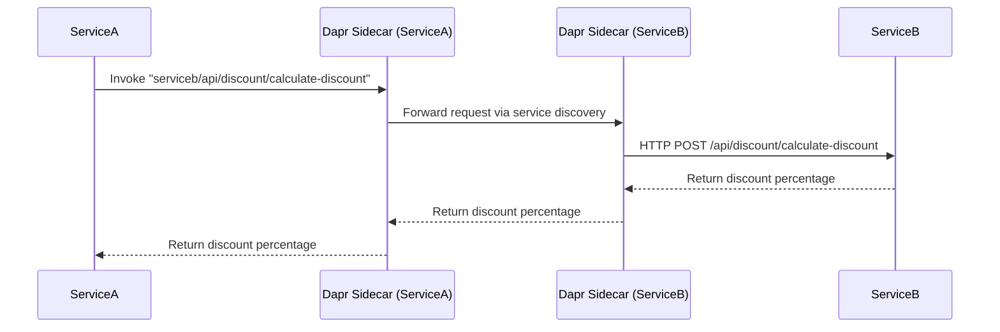

This article shows how to use `Service Invocation` with `DAPR`'s building block, combined with `.NET Aspire` for orchestration.

You'll learn how services can communicate reliably in a distributed environment, with `Aspire` managing the setup and `DAPR` providing service discovery and resilient invocation patterns.




---

## Resources

### 👩‍💻 Source Code

If you are stuck, you can refer the final source code, available at [GitHub Repository](https://github.com/NetRecipes/service-invocation)

## What is Service Invocation, and Why It Matters?

**Service invocation** is the ability of one service to call another service's API in a distributed system.

In microservices architectures, services need to communicate with each other — an order service might call a pricing service, or a frontend might call multiple backend APIs.

Without proper service invocation patterns, you face challenges like hardcoded URLs, lack of service discovery, no retry logic, and difficult debugging across service boundaries.

## Synchronous vs Asynchronous Communication

In distributed systems, services can communicate in two fundamental ways:

| Aspect | Synchronous Communication | Asynchronous Communication |
|--------|--------------------------|----------------------------|
| **Pattern** | Request-Response | Fire-and-Forget / Event-Driven |
| **Waiting** | Caller waits for response | Caller continues immediately |
| **Coupling** | Tight coupling — caller knows callee | Loose coupling — via message broker |
| **Use Case** | Direct queries, immediate results needed | Background tasks, event notifications |
| **Example** | Get user profile, calculate price | Send email, process order, update analytics |
| **DAPR Building Block** | **Service Invocation** ([this article](#)) | **Pub/Sub** ([see article](/courses/dapr-aspire/pub-sub/)) |
| **Failure Handling** | Immediate error response | Retry via message queue |

**This article focuses on synchronous service-to-service communication** using `DAPR`'s Service Invocation building block. When `ServiceA` invokes `ServiceB`, it waits for the response before continuing.

> 💡 **Note:** For asynchronous communication patterns where services communicate through events and message brokers without waiting for responses, refer to the [📨 Pub-Sub article](/courses/dapr-aspire/pub-sub/).

For example, think of an e‑commerce system where `ServiceA` needs to calculate discounted prices by calling `ServiceB`'s discount calculation endpoint.  
Without `DAPR`, you'd need to:

- Manually manage service URLs and ports
- Implement your own retry and timeout logic
- Handle service discovery yourself
- Deal with networking complexities

`DAPR` solves this by providing a simple, consistent API for service-to-service communication, while `Aspire` orchestrates the environment so services can discover and call each other seamlessly.

You get built-in service discovery, automatic retries, distributed tracing, and the flexibility to switch between different invocation methods — all without changing your service code.

> 💡 **Note:** `DAPR`'s service invocation isn't just about making HTTP calls — it provides resilience patterns, observability, and security features that would otherwise require significant custom implementation.

## Hands‑On Setup

We'll scaffold a new `.NET Aspire` solution and add two Web API services that communicate with each other.

Each command below is shown individually with its purpose explained.

### 1. Create the Aspire host project

This sets up the orchestration project named `ServiceInvocation`.

```bash
dotnet new aspire --name ServiceInvocation --no-https --output .
```

### 2. Create the 2 Web API services

Generates 2 Web API projects called `ServiceA` & `ServiceB` using controllers.

And add both services to the solution

```bash
dotnet new webapi --name ServiceA --no-https --use-controllers
dotnet new webapi --name ServiceB --no-https --use-controllers
dotnet sln add .\ServiceA\ .\ServiceB\
```

### 3. Migrate to the new `.slnx` format (Optional)

Converts the solution to the modern format used by Aspire.  
And cleans up the legacy solution file, leaving only `ServiceInvocation.slnx`.

```bash
dotnet sln migrate
rm ServiceInvocation.sln
```

> 💡 **Note:** The newer `.slnx` solution format is a general .NET enhancement. It's cleaner and more minimal than the traditional `.sln`, reducing boilerplate and making solutions easier to manage in modern .NET projects.

Now, open `ServiceInvocation.slnx` with `Visual Studio` or `Rider`, or simply open the directory with `VS Code`.

Alternatively, you can skip these steps and clone the final companion repository: [NetRecipes/service-invocation](https://github.com/NetRecipes/service-invocation).

## NuGet Packages

Depending on your IDE, install the following NuGet packages in the specified projects:

### ServiceA and ServiceB

In both `ServiceA` and `ServiceB` projects, install the following NuGet packages to enable `DAPR` integration, API documentation, and UI enhancements.

(Note: `Microsoft.AspNetCore.OpenApi` is usually included by default in the Web API template, so you may not need to install it separately.)

| Package ID | Purpose |
|------------|---------|
| [Dapr.AspNetCore](https://www.nuget.org/packages/Dapr.AspNetCore) | Adds DAPR integration to ASP.NET Core, including service invocation, state management, pub/sub, and bindings. |
| [Swashbuckle.AspNetCore.SwaggerUI](https://www.nuget.org/packages/Swashbuckle.AspNetCore.SwaggerUI) | Provides Swagger UI for interactive API documentation and testing. |
| [AspNetCore.SwaggerUI.Themes](https://www.nuget.org/packages/AspNetCore.SwaggerUI.Themes) | Adds modern, customizable themes to Swagger UI for better developer experience. |

```bash
dotnet add ServiceA package Dapr.AspNetCore
dotnet add ServiceA package Swashbuckle.AspNetCore
dotnet add ServiceA package Swashbuckle.AspNetCore.SwaggerUI
dotnet add ServiceA package AspNetCore.SwaggerUI.Themes
```

### ServiceInvocation.AppHost

In the `ServiceInvocation.AppHost` project, install the following NuGet package to enable integration with `DAPR` sidecars.

| Package ID | Purpose |
|------------|---------|
| [CommunityToolkit.Aspire.Hosting.Dapr](https://www.nuget.org/packages/CommunityToolkit.Aspire.Hosting.Dapr) | Integrates DAPR sidecars into an Aspire application, enabling service orchestration with DAPR building blocks. |

```bash
dotnet add ServiceInvocation.AppHost package CommunityToolkit.Aspire.Hosting.Dapr
```

## Code Walkthrough

With the setup complete, let's implement service invocation between `ServiceA` and `ServiceB`.

### 1. Program.cs – Add DAPR support (Both Services)

In both `ServiceA/Program.cs` and `ServiceB/Program.cs`, register DAPR services and Swagger UI:

```csharp
using AspNetCore.Swagger.Themes;

var builder = WebApplication.CreateBuilder(args);

builder.AddServiceDefaults(); // Aspire hosting helpers

builder.Services.AddDaprClient(); // Enables DAPR integration
builder.Services.AddControllers().AddDapr(); // Adds DAPR support to controllers

builder.Services.AddOpenApi();

var app = builder.Build();

if (app.Environment.IsDevelopment())
{
    app.MapOpenApi();
    app.UseSwaggerUI(
        Theme.Futuristic,
        options => options.SwaggerEndpoint("/openapi/v1.json", "ServiceA v1")); // Change to ServiceB for ServiceB
}

app.UseAuthorization();

app.UseCloudEvents();
app.MapControllers();
app.MapSubscribeHandler();

app.Run();
```

Also create a Common class library project, that can be refered by both `ServiceA` and `ServiceB` to contain a commaon `record` / `POCO`

```cs
public record Order(string Product, int Quantity, decimal PricePerUnit);
```

> It's fine to skip the Common project and just have the record in both the projects as well, for simplicity

### 2. DiscountController.cs – Create the target endpoint in ServiceB

Create a controller `Controllers/DiscountController.cs` in `ServiceB` that will be invoked by `ServiceA`.

```csharp
[HttpPost("calculate-discount")]
[ProducesResponseType(StatusCodes.Status200OK)]
public async Task<IActionResult> CalculateDiscount([FromBody] Order order)
{
    decimal discountInPercentage = 0.0m;

    if (order.Quantity >= 12)
    {
        discountInPercentage = 10.0m;
    }

    logger.LogInformation("Calculated discount is {Discount}%", discountInPercentage);

    return Ok(discountInPercentage);
}
```

### 3. PricingController.cs – Invoke ServiceB from ServiceA

Create a controller `Controllers/PricingController.cs` in `ServiceA` that will invoke `ServiceB` using `DAPR`.

```csharp
[HttpPost("calculate-price")]
public async Task<IActionResult> Calculate([FromBody] Order order)
{
    logger.LogInformation("Calculating discount for {Order}", order);

    var request = daprClient.CreateInvokeMethodRequest<Order>(
        HttpMethod.Post,
        "serviceb", // App ID
        "/api/discount/calculate-discount",
        [],
        order);

    var response = await daprClient.InvokeMethodAsync<decimal>(request);

    var totalPrice = order.PricePerUnit * order.Quantity;
    var discountedPrice = totalPrice - (totalPrice / 100.0m * response);
    return Ok(discountedPrice);
}
```

**Key points about the invocation:**

- `"serviceb"` is the `DAPR` app ID, not a URL
- `DAPR` handles service discovery automatically
- No need to know the actual host, port, or protocol
- Built-in retries and observability

### 4. Configure Services in AppHost

In `ServiceInvocation.AppHost/Program.cs`, configure both services with `DAPR` sidecars:

```csharp
var builder = DistributedApplication.CreateBuilder(args);

var servicea = builder
    .AddProject<Projects.ServiceA>("servicea")
    .WithDaprSidecar();

var serviceb = builder
    .AddProject<Projects.ServiceB>("serviceb")
    .WithDaprSidecar();

builder.Build().Run();
```

**Important configuration details:**

- Each service gets its own `DAPR` sidecar
- `WaitFor(serviceb)` ensures `ServiceB` is ready before `ServiceA` starts
- `DAPR` app IDs are automatically derived from the service names
- No manual URL configuration needed

## Running the Application

Now, when you run your setup, you should see the Aspire dashboard with both services.


### Testing the Service Invocation

- Visit the `ServiceA`'s Swagger endpoint, with `/swagger` at the end of the URL

- Call the `/api/pricing/calculate-price` endpoint with a request body:

    **Request**

    ```json
    {
    "product": "Banana",
    "quantity": 12,
    "pricePerUnit": 2.99
    }
    ```

- You'll receive a response like:

    **Response**

    ```json
    32.292
    ```


### What's Happening Behind the Scenes

When you make this request:

1. `ServiceA` receives your pricing request
2. `ServiceA` uses `DAPR` to invoke `ServiceB` by its app ID (`"serviceb"`)
3. `DAPR`'s sidecar for `ServiceA` discovers `ServiceB`'s location
4. The request is forwarded through `DAPR` sidecars
5. `ServiceB` calculates the discount
6. The response travels back through the sidecars
7. `ServiceA` receives the discount and calculates the final price



All of this happens transparently, with built-in retries, timeouts, and distributed tracing.

## DAPR Service Invocation Benefits

By using DAPR for service invocation, you get several advantages:

### Service Discovery

No hardcoded URLs or ports. Services find each other using app IDs. When services scale or move, DAPR handles the discovery automatically.

- [x] **Resilience**  
Built-in retries, timeouts, and circuit breakers without writing custom code.  
`DAPR` handles transient failures gracefully.

- [x] **Observability**  
Automatic distributed tracing across service calls.  
You can see the entire request flow in the `Aspire` dashboard and other observability tools.

#### *Structured Logging*


#### *Distributed Tracing*


- [x] **Security**  
Support for mTLS, access control policies, and API token authentication.  
Services can communicate securely without manual certificate management.

- [x] Flexibility  
Switch between HTTP, gRPC, or other protocols without changing service code.  
`DAPR` abstracts the communication layer.

## Summary

With `DAPR` and `Aspire`, you can build resilient, discoverable service-to-service communication with minimal boilerplate.

Instead of managing URLs, retries, and timeouts manually, DAPR handles these concerns automatically — thanks to `DAPR`'s abstraction and `Aspire`'s orchestration.

Your services communicate by app ID, not by URL, making them more maintainable and cloud-ready from day one.
