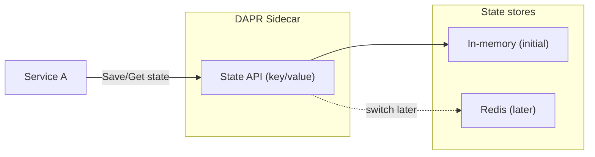

This article shows how to use state management with **`DAPR`**’s building block, combined with **`.NET Aspire`** for orchestration.  
You’ll learn how a service can persist and retrieve data reliably in a distributed environment, with **`Aspire`** managing the setup and **`DAPR`** providing the abstraction for the state store.



---

## Resources

### 👩‍💻 Source Code

If you are stuck, you can refer the final source code, available at [GitHub Repository](https://github.com/NetRecipes/state-management)

---

## What is State Management, and Why It Matters?

`State management` is the ability of an application to store and retrieve data across requests and service boundaries.  
In distributed systems, services are often stateless by design — they scale easily but lose context once a request ends.  
Without proper state management, data consistency, reliability, and user experience quickly break down.  

For example, think of a shopping cart in an e‑commerce app: without state management, every request would forget the items a user added.  
Or consider a workflow where multiple services process an order — without state persistence, the system could lose track of progress if a service restarts.  

**`DAPR`** solves this by providing a simple, consistent API for state storage, while **`Aspire`** orchestrates the environment so services can use it seamlessly.  
You can start with an in‑memory store for local testing, then switch to **`Redis`** for durability and scale — all without changing your service code, thanks to the power of abstraction.  

> 💡 Note: In this context, **`Redis`** is used as a durable state store — distinct from *caching*, which is typically about temporary performance optimization.

## Hands‑On Setup

We’ll scaffold a new **`.NET Aspire`** solution and add a simple Web API service.  
Each command below is shown individually with its purpose explained.

### 1. Create the Aspire host project

This sets up the orchestration project named `StateManagement`.

```sh
dotnet new aspire --name StateManagement --no-https --output .
```

### 2. Create the Web API service

Generates a Web API project called `ServiceA` using controllers.

```sh
dotnet new webapi --name ServiceA --no-https --use-controllers
```

### 3. Add the service to the solution

Registers `ServiceA` into the solution so it’s managed by **`Aspire`**.

```sh
dotnet sln add .\ServiceA\
```

### 4. Migrate to the new `.slnx` format (Optional)

Converts the solution to the modern format used by **`Aspire`**.

```sh
dotnet sln migrate
```

### 5. Remove the old `.sln` file

Cleans up the legacy solution file, leaving only `StateManagement.slnx`.

```sh
rm StateManagement.sln
```

> 💡 Note: The newer `.slnx` solution format is a general .NET enhancement. It’s cleaner and more minimal than the traditional `.sln`, reducing boilerplate and making solutions easier to manage in modern .NET projects.

Now, open `StateManagement.slnx` with Visual Studio or Rider, or simply open the directory with VS Code.  
Alternatively, you can skip these steps and clone the final companion repository: [NetRecipes/state-management](https://github.com/NetRecipes/state-management).

---

## NuGet Packages

Depending on your IDE, install the following NuGet packages in the specified projects:

### ServiceA

In the **`ServiceA`** project, install the following NuGet packages to enable API documentation, state management, and UI enhancements.  
(*Note: `Microsoft.AspNetCore.OpenApi` is usually included by default in the Web API template, so you may not need to install it separately.*)

| Package ID | Purpose |
|------------|---------|
| [Dapr.AspNetCore](https://www.nuget.org/packages/Dapr.AspNetCore) | Provides integration with **`DAPR`**, including state management, pub/sub, and bindings for ASP.NET Core services. |
| [Swashbuckle.AspNetCore.SwaggerUI](https://www.nuget.org/packages/Swashbuckle.AspNetCore.SwaggerUI) | Adds interactive Swagger UI for exploring and testing your Web API endpoints. |
| [AspNetCore.SwaggerUI.Themes](https://www.nuget.org/packages/AspNetCore.SwaggerUI.Themes) | Allows customization of Swagger UI with themes for a cleaner developer experience. |

```sh
dotnet add ServiceA package Dapr.AspNetCore
dotnet add ServiceA package Swashbuckle.AspNetCore.SwaggerUI
dotnet add ServiceA package AspNetCore.SwaggerUI.Themes
```

### StateManagement.AppHost

In the **`StateManagement.AppHost`** project, install the following NuGet packages to enable integration with **`DAPR`** and configure a Redis state store.

| Package ID | Purpose |
|------------|---------|
| [CommunityToolkit.Aspire.Hosting.Dapr](https://www.nuget.org/packages/CommunityToolkit.Aspire.Hosting.Dapr) | Provides hosting extensions to integrate **`DAPR`** sidecars into an **`Aspire`** application, enabling service orchestration with DAPR building blocks. |
| [Aspire.Hosting.Redis](https://www.nuget.org/packages/Aspire.Hosting.Redis) | Adds Redis support to **`Aspire`** hosting, allowing you to configure Redis as a state store or cache in your distributed environment. |

```sh
dotnet add StateManagement.AppHost package CommunityToolkit.Aspire.Hosting.Dapr
dotnet add StateManagement.AppHost package Aspire.Hosting.Redis
```

---

## Code Walkthrough

With the setup complete, let’s implement state management in `ServiceA`.

### 1. Program.cs – Add DAPR support

In `ServiceA/Program.cs`, register DAPR services and Swagger UI:

```cs
using AspNetCore.Swagger.Themes;

var builder = WebApplication.CreateBuilder(args);
builder.AddServiceDefaults(); // Aspire hosting helpers
builder.Services.AddDaprClient(); // Enables DAPR integration
builder.Services.AddControllers().AddDapr(); // Adds DAPR support to controllers

builder.Services.AddOpenApi();

var app = builder.Build();
if (app.Environment.IsDevelopment())
{
    app.MapOpenApi();
    app.UseSwaggerUI(
        ModernStyle.Futuristic,
        options => options.SwaggerEndpoint("/openapi/v1.json", "ServiceA v1")); // Optional
}

app.UseAuthorization();
app.UseCloudEvents();
app.MapControllers();
app.MapSubscribeHandler();
app.Run();
```

---

### 2. StateController.cs – Persist and retrieve state

Create a controller `Controllers/StateController.cs` to demonstrate saving and getting state.

```csharp
[Route("api/[controller]")]
[ApiController]
public class StateController(
    DaprClient daprClient,
    ILogger<StateController> logger) : ControllerBase
{
}
```

**Write State**

```cs
[HttpPost("write")]
public async Task<IActionResult> Write([FromBody] Product product)
{
    logger.LogInformation("Writing {Product} to state store", product);
    await daprClient.SaveStateAsync("statestore", product.Id.ToString(), product);
    return Ok(product);
}
```

**Read State**

```cs
[HttpGet("read")]
[ProducesResponseType(StatusCodes.Status200OK)]
[ProducesResponseType(StatusCodes.Status404NotFound)]
public async Task<IActionResult> Read(int id)
{
    var state = await daprClient.GetStateEntryAsync<Product>("statestore", id.ToString());
    var product = state?.Value;

    if (product is null)
    {
        return NotFound();
    }

    logger.LogInformation("Reading {Product}, corresponding to {Id} from state store", product, id);
    return Ok(product);
}
```

The Product model can be defined as a simple `record` or `POCO`:

```cs
public record Product(int Id, string Name, decimal Price);
```

---

### 3. Configure State Store in AppHost

In `StateManagement.AppHost/Program.cs`, configure Redis as the state store:

```csharp
using CommunityToolkit.Aspire.Hosting.Dapr;

var builder = DistributedApplication.CreateBuilder(args);

// Create an instance of Redis
var redisPassword = builder.AddParameter("RedisPassword", true);
var redisPort = builder.AddParameter("RedisPort");
var portValue = await redisPort.Resource.GetValueAsync(CancellationToken.None);

var redis = builder
    .AddRedis("redis", int.Parse(portValue!), redisPassword)
    .WithRedisInsight(); // integrated Redis Insight

var servicea = builder
    .AddProject<Projects.ServiceA>("service-a")
    .WithExternalHttpEndpoints()
    .WaitFor(redis)
    .WithDaprSidecar(new DaprSidecarOptions
    {
        ResourcesPaths = [Path.Combine("..", "components")]
    });

builder.Build().Run();
```

You’ll need a `components/statestore.yaml` file with the following content:

```yaml
apiVersion: dapr.io/v1alpha1
kind: Component
metadata:
  name: statestore
spec:
  type: state.in-memory
  version: v1
  metadata:
```

> Note: For in-memory state stores, no additional metadata fields are required.

Now, when you run your setup, you should see Aspire dashboard.

You can visit the `ServiceA`'s Swagger endpoint, with `/swagger` at the end of the URL


When you call the `/write` endpoint, you can see it writes the state `in-memory`


When you call `/read` endpoint, it gets back the state from `in-memory`


---

## In-Memory State Store

When I say, it writes `in-memory`, that's because, how it's configured in the `statestore.yaml`

```yaml
type: state.in-memory
```

## Redis State Store

Now if you want to see the real power of abstraction, stop the debugger, replace the contents of `components/statestore.yaml` with below content

```yaml
apiVersion: dapr.io/v1alpha1
kind: Component
metadata:
  name: statestore
spec:
  type: state.redis
  version: v1
  metadata:
  - name: redisHost
    value: localhost:6500
  - name: redisPassword
    value: "localDev"
  - name: keyprefix
    value: none
```

This will use `Redis` as it's state store.

> Note: Port 6500 is used here to show you can use any port, not just the default `6379`.

Notice how the `type` is now set to `state.redis`, switching the backend from `in-memory` to `Redis`.

To pass the `Redis` credentials, update the `appsettings.Development.json` file in the `StateManagement.AppHost` project:

```json
{
  "Logging": {
    ...
  },
  "Parameters": {
    "RedisPort": "6500",
    "RedisPassword": "localDev"
  }
}
```

> Note the same password is configured in yaml file.

Now, when you run, both `/write` and `/read` endpoints works as before. Nothing changed. Or, that's how it appears.  
But when you `write` state value, you can see it is actually written in the `Redis` instance, by visualizing with integrated `Redis Insight`, accessible from `Aspire Dashboard`.


This demonstrates `DAPR`'s powerful abstraction layer — no implementation changes, just a configuration switch.

No implementation changes, just switch to any supported `DAPR` [State Stores](https://docs.dapr.io/reference/components-reference/supported-state-stores/), without changing implementation logic or boilerplate. You don’t even need a different NuGet package.

Changes to the `AppHost` project are orchestration concerns, not service implementation — similar to how `Docker Compose` manages container configuration.

---

## Summary

With `DAPR` and `Aspire`, you can build resilient, stateful services with minimal boilerplate.  
Whether you start with `in-memory` or switch to `Redis`, the service logic stays the same — thanks to `DAPR`'s abstraction and `Aspire`’s orchestration.
