🚧 Phase 2: Advanced `DAPR` Building Blocks

This is a continuation of our [.NET Aspire + DAPR course](../dapr-aspire/), exploring six additional building blocks that enable even more powerful distributed system patterns.  
These advanced capabilities complement the foundational blocks from Phase 1.

```mermaid
flowchart LR
    root((.NET Aspire + DAPR<br/>Phase 2))
    wf[⚡ Workflow]
    act[🎭 Actors]
    lock[🔒 Distributed Lock]
    crypto[🔐 Cryptography]
    jobs[⏰ Jobs]
    conv[💬 Conversation]

    root --> wf
    root --> act
    root --> lock
    root --> crypto
    root --> jobs
    root --> conv
```

