This course teaches you battle-tested design patterns every C# developer should know — from `Creational` to `Structural` to `Behavioral` patterns.  
We use practical C# examples with modern .NET features to show when and how to apply each pattern effectively.  
By the end of the course, you'll have a solid toolkit of proven solutions to common software design challenges you face daily.

## Prerequisites

To follow along comfortably, you're expected to have:

1. A compatible IDE such as **Visual Studio 2026** (recommended), **JetBrains Rider**, or **VS Code** with the **C# Dev Kit** extension
2. Working knowledge of **C#** and object-oriented programming fundamentals
3. Basic understanding of **interfaces**, **inheritance**, and **polymorphism** in C#

```mermaid
flowchart LR
    root((Design Patterns))
    
    creational[🏗️ Creational Patterns]
    structural[🔧 Structural Patterns]
    behavioral[🎭 Behavioral Patterns]
    
    singleton[🔒 Singleton]
    factory[🏭 Factory Method]
    builder[🧱 Builder]
    abstract-factory[🏢 Abstract Factory]
    prototype[🐑 Prototype]
    
    decorator[🎁 Decorator]
    adapter[🔌 Adapter]
    facade[🏛️ Facade]
    proxy[🚪 Proxy]
    composite[🌳 Composite]
    bridge[🌉 Bridge]
    flyweight[🪶 Flyweight]
    
    strategy[🎯 Strategy]
    observer[👁️ Observer]
    command[📋 Command]
    template[📝 Template Method]
    state[🔄 State]
    chain[⛓️ Chain of Responsibility]
    iterator[🔁 Iterator]
    mediator[🤝 Mediator]
    visitor[🚶 Visitor]
    memento[💾 Memento]
    interpreter[📖 Interpreter]
    
    root --> creational
    root --> structural
    root --> behavioral
    
    creational --> singleton
    creational --> factory
    creational --> builder
    creational --> abstract-factory
    creational --> prototype
    
    structural --> decorator
    structural --> adapter
    structural --> facade
    structural --> proxy
    structural --> composite
    structural --> bridge
    structural --> flyweight
    
    behavioral --> strategy
    behavioral --> observer
    behavioral --> command
    behavioral --> template
    behavioral --> state
    behavioral --> chain
    behavioral --> iterator
    behavioral --> mediator
    behavioral --> visitor
    behavioral --> memento
    behavioral --> interpreter
    
    click singleton "/courses/design-patterns/creational/singleton/" "Go to Singleton Pattern"
    click factory "/courses/design-patterns/creational/factory-method/" "Go to Factory Method Pattern"
    click builder "/courses/design-patterns/creational/builder/" "Go to Builder Pattern"
    click abstract-factory "/courses/design-patterns/creational/abstract-factory/" "Go to Abstract Factory Pattern"
    click prototype "/courses/design-patterns/creational/prototype/" "Go to Prototype Pattern"
    
    click decorator "/courses/design-patterns/structural/decorator/" "Go to Decorator Pattern"
    click adapter "/courses/design-patterns/structural/adapter/" "Go to Adapter Pattern"
    click facade "/courses/design-patterns/structural/facade/" "Go to Facade Pattern"
    click proxy "/courses/design-patterns/structural/proxy/" "Go to Proxy Pattern"
    click composite "/courses/design-patterns/structural/composite/" "Go to Composite Pattern"
    click bridge "/courses/design-patterns/structural/bridge/" "Go to Bridge Pattern"
    click flyweight "/courses/design-patterns/structural/flyweight/" "Go to Flyweight Pattern"
    
    click strategy "/courses/design-patterns/behavioral/strategy/" "Go to Strategy Pattern"
    click observer "/courses/design-patterns/behavioral/observer/" "Go to Observer Pattern"
    click command "/courses/design-patterns/behavioral/command/" "Go to Command Pattern"
    click template "/courses/design-patterns/behavioral/template-method/" "Go to Template Method Pattern"
    click state "/courses/design-patterns/behavioral/state/" "Go to State Pattern"
    click chain "/courses/design-patterns/behavioral/chain-of-responsibility/" "Go to Chain of Responsibility Pattern"
    click iterator "/courses/design-patterns/behavioral/iterator/" "Go to Iterator Pattern"
    click mediator "/courses/design-patterns/behavioral/mediator/" "Go to Mediator Pattern"
    click visitor "/courses/design-patterns/behavioral/visitor/" "Go to Visitor Pattern"
    click memento "/courses/design-patterns/behavioral/memento/" "Go to Memento Pattern"
    click interpreter "/courses/design-patterns/behavioral/interpreter/" "Go to Interpreter Pattern"

    click creational "/courses/design-patterns/creational" "Go to Creational"
    click structural "/courses/design-patterns/structural" "Go to Structural"
    click behavioral "/courses/design-patterns/behavioral" "Go to Behavioral"
```

## What to Expect from This Course

This is a **quick reference guide**, not an in-depth tutorial. Each pattern includes:

* A concise explanation of **what the pattern does** and **when to use it**.
* Practical **C# code examples** demonstrating the pattern in action.
* Links to a **companion GitHub repository** with complete, working implementations for closer examination.

Use this course to **refresh your memory** before an interview, **quickly compare** patterns when designing a solution, or **grab a reference implementation** when you need to apply a pattern in your project.
