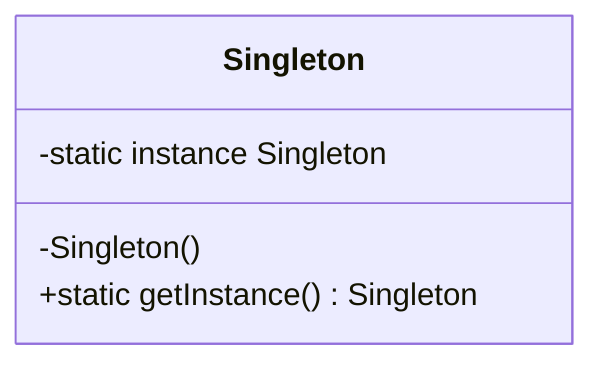

The Singleton pattern restricts a class to a single instance throughout the application lifetime, providing a global access point to that instance. It's useful when exactly one object is needed to coordinate actions across the system, such as managing shared resources or maintaining application-wide state.

## Resources

### 👩‍💻 Source Code

If you are stuck, you can refer the final source code, available at [Singleton](https://github.com/NetRecipes/design-patterns/blob/main/DesignPatterns/Creational/Singleton.cs)

## Intent

Ensure a class has only one instance and provide a global point of access to it.

## Structure



## Implementation

Here's a modern C# implementation using `Lazy<T>` for thread-safe lazy initialization:

```cs
public class Singleton
{
    private Singleton() { }

    private static readonly Lazy<Singleton> _instance = new(() => new Singleton());

    public static Singleton Instance => _instance.Value;
}
```

**Key implementation details:**

- **Private constructor** prevents direct instantiation from outside the class
- **`Lazy<T>`** provides thread-safe lazy initialization without explicit locking
- **Static property** gives global access to the single instance
- Instance is created only when first accessed (lazy initialization)

> 💡 **Note**: In production applications, prefer using dependency injection with `.AddSingleton()` instead of implementing the Singleton pattern manually. DI containers handle the lifecycle management for you, keeping your classes focused on their core responsibility (Single Responsibility Principle). Explicit Singleton implementation adds the burden of managing object lifetime alongside your business logic.

## Key Points

- **Thread-safe by default**: `Lazy<T>` handles thread safety without manual locking, eliminating the need for double-check locking patterns
- **Lazy initialization**: The instance is created only when first accessed, not at application startup, saving resources if the singleton is never used
- **Global state concerns**: Singletons introduce global state into your application, which can make testing harder and create hidden dependencies between classes
- **Avoid overuse**: Not every "manager" or "service" class needs to be a Singleton. Prefer dependency injection for managing object lifetimes in modern applications
- **When NOT to use**: If your class has no state or only contains utility methods, consider making it static instead. If you need multiple instances in tests, Singleton makes mocking difficult

## Real-World Examples

| Example/Scenario | How the pattern applies |
|-----------------|------------------------|
| **Configuration Manager** | Application-wide settings need a single source of truth. Multiple instances would create inconsistencies and waste memory storing duplicate configuration data. |
| **Logger** | Centralizing log output through one instance ensures consistent formatting, prevents file access conflicts, and maintains a single point of control for log levels and destinations. |
| **Database Connection Pool** | Managing connections through a single coordinator prevents connection leaks, enforces connection limits, and provides efficient resource sharing across the application. |
| **Cache Manager** | A shared cache instance prevents duplicate data in memory, ensures all parts of the application see the same cached values, and centralizes cache invalidation logic. |
| **Hardware Interface** | Accessing hardware resources like printers or serial ports through one instance prevents conflicts from simultaneous access and ensures proper resource cleanup. |

## Related Patterns

Singleton is often used with **Abstract Factory**, **Builder**, and **Prototype** patterns when the factory, builder, or prototype registry itself needs to be a single shared instance. It differs from **Monostate** which achieves similar behavior through shared static state rather than instance restriction.