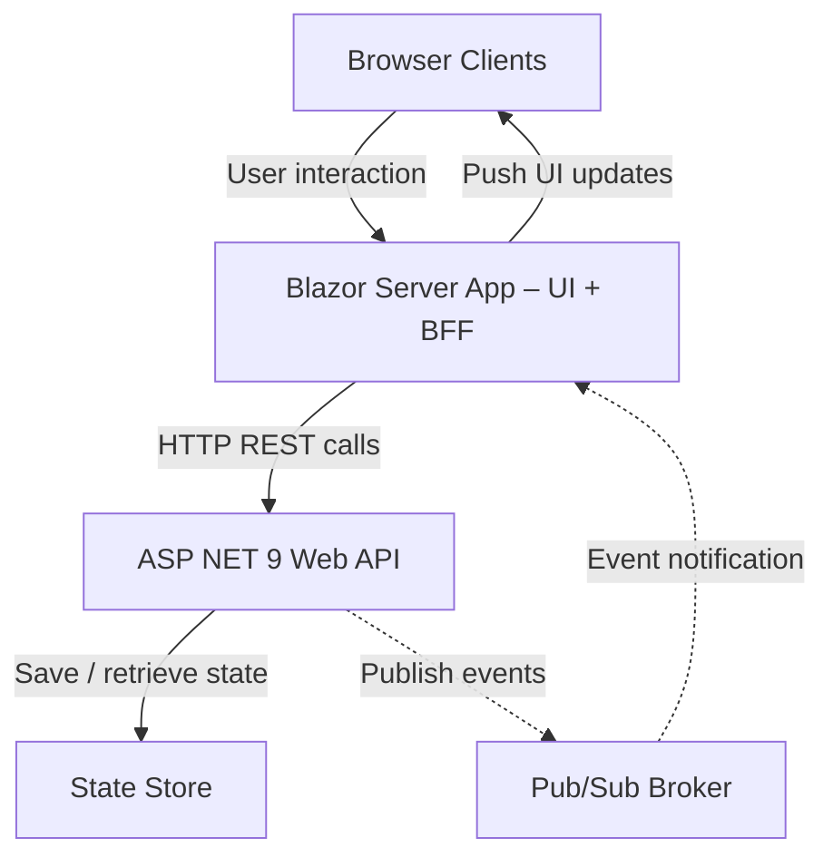
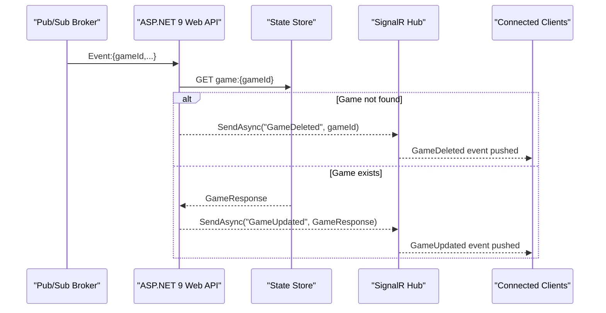

Endpoints, Service Contracts and Sequence Diagrams for building a `Scrum Poker` app.

---

## High level design



---

## Endpoints

| Operation | Method & Path | Request Body (DTO) | Success Response | Error Codes (body → Error) |
| --- | --- | --- | --- | --- |
| [Create New Game](#file-01-create-new-game-md) | POST `/games` | **CreateGameRequest**<br/>```json<br/>{<br/>  "player": "string"<br/>}``` | **201 Created**<br/>`GameResponse` | 422 Unprocessable Entity (invalid player) |
| [Join Existing Game](#file-02-join-existing-game-md) | POST `/games/{gameId}/join` | **JoinGameRequest**<br/>```json<br/>{<br/>  "player": "string"<br/>}``` | **200 OK**<br/>`GameResponse` | 422 Unprocessable Entity (invalid player)<br/>404 Not Found<br/>409 Conflict (already joined) |
| [Submit Vote](#file-03-submit-vote-md) | POST `/games/{gameId}/vote` | **VoteRequest**<br/>```json<br/>{<br/>  "player": "string",<br/>  "value": 13<br/>}``` | **200 OK**<br/>`GameResponse` | 422 Unprocessable Entity (invalid vote/player)<br/>404 Not Found<br/>409 Conflict (not joined) |
| [Reset Votes](#file-04-reset-votes-md) | POST `/games/{gameId}/votes/reset` | _No body_ (path-only) | **200 OK**<br/>`GameResponse` | 422 Unprocessable Entity (invalid gameId)<br/>404 Not Found |
| [Get Game State](#file-05-get-game-state-md) | GET /games/{gameId} | — | 200 OK + GameResponse | 404 Not Found |
| [Remove a Player](#file-06-remove-a-player-md) | DELETE /admin/games/{gameId}/players/{player} | — | 204 No Content | 404 Not Found, 409 Conflict (not in game) |
| [End Game](#file-07-end-game-md) | DELETE /admin/games/{gameId} | — | 204 No Content | 404 Not Found |

---

## Client Updates - Real-time

This flow is common for all endpoints


