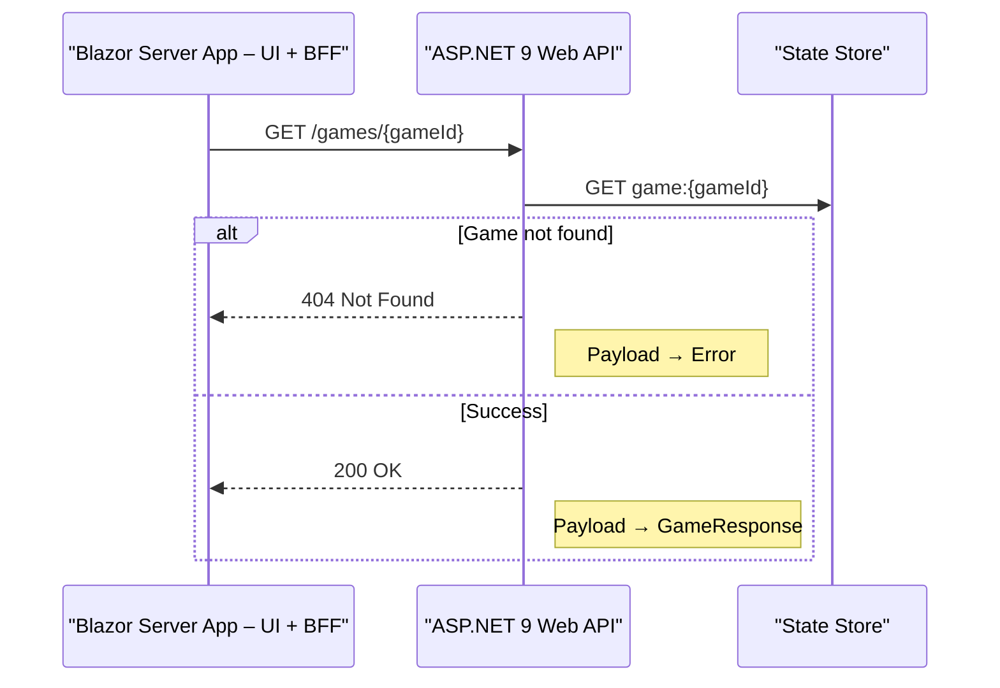
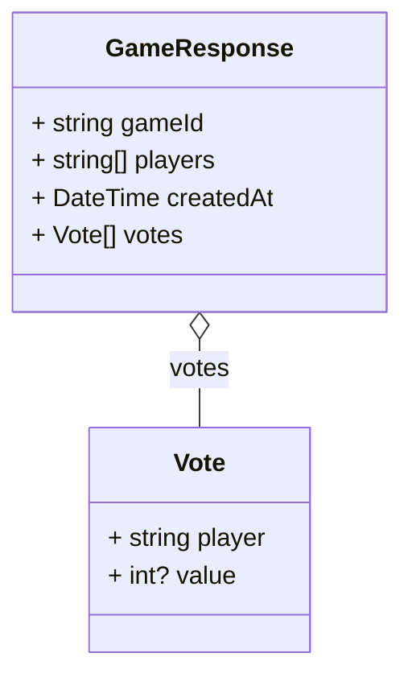
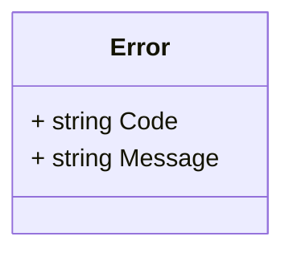

```mermaid
sequenceDiagram
  participant BFF as "Blazor Server App – UI + BFF"
  participant API as "ASP.NET 9 Web API"
  participant Store as "State Store"

  BFF->>API: GET /games/{gameId}
  API->>Store: GET game:{gameId}

  alt Game not found
    API-->>BFF: 404 Not Found  
    Note right of API: Payload → Error
  else Success
    API-->>BFF: 200 OK  
    Note right of API: Payload → GameResponse
  end

```

---

## Response

```mermaid
classDiagram
    class GameResponse {
      + string gameId
      + string[] players
      + DateTime createdAt
      + Vote[] votes
    }
    class Vote {
      + string player
      + int? value
    }

    GameResponse o-- Vote : votes
```

---

## Error

```mermaid
classDiagram
    class Error {
      + string Code
      + string Message
    }
```
