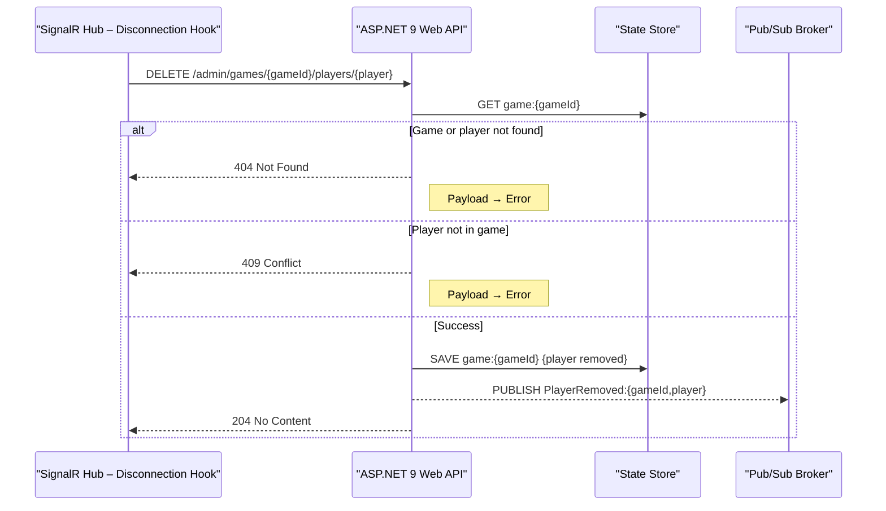
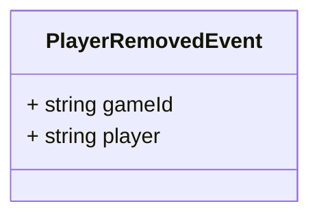

```mermaid
sequenceDiagram
  participant SignalR as "SignalR Hub – Disconnection Hook"
  participant API as "ASP.NET 9 Web API"
  participant Store as "State Store"
  participant PubSub as "Pub/Sub Broker"

  SignalR->>API: DELETE /admin/games/{gameId}/players/{player}
  API->>Store: GET game:{gameId}

  alt Game or player not found
    API-->>SignalR: 404 Not Found  
    Note right of API: Payload → Error
  else Player not in game
    API-->>SignalR: 409 Conflict  
    Note right of API: Payload → Error
  else Success
    API->>Store: SAVE game:{gameId} {player removed}
    API-->>PubSub: PUBLISH PlayerRemoved:{gameId,player}
    API-->>SignalR: 204 No Content
  end

```

## Publish - PlayerRemoved

```mermaid
classDiagram
    class PlayerRemovedEvent {
      + string gameId
      + string player
    }
```
