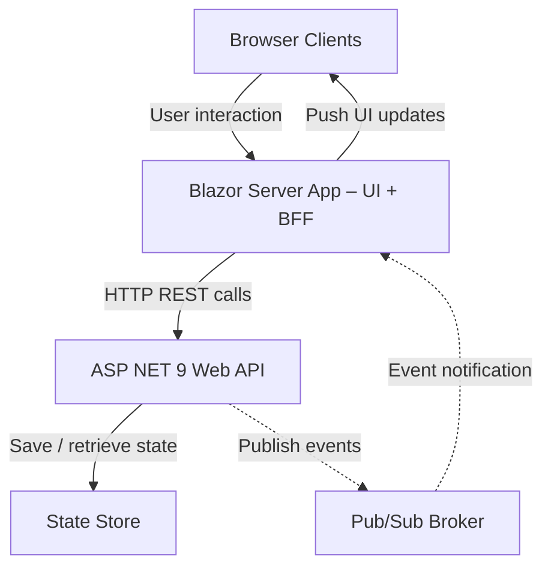
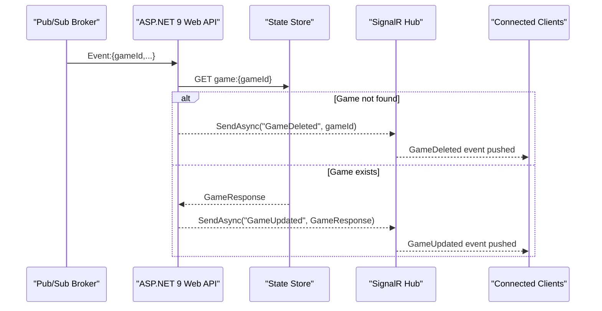

Endpoints, Service Contracts and Sequence Diagrams for building a `Scrum Poker` app.

---

## High level design

---

## Endpoints

| Operation | Method & Path |
| --- | --- |
| [Create New Game](./create-new-game) | **POST** `/games` |
| [Join Existing Game](./join-existing-game) | **POST** `/games/{gameId}/join` |
| [Submit Vote](./submit-vote) | **POST** `/games/{gameId}/vote` |
| [Reset Votes](./reset-votes) | **POST** `/games/{gameId}/votes/reset` |
| [Get Game State](./get-game-state) | **GET** `/games/{gameId}` |
| [Remove a Player](./remove-a-player) | **DELETE** `/admin/games/{gameId}/players/{player}` |
| [End Game](./end-game) | **DELETE** `/admin/games/{gameId}` |

---

## Client Updates - Real-time

This flow is common for all endpoints

