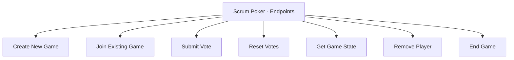

```mermaid
graph TD
    API[Scrum Poker - Endpoints]
    API --> A[Create New Game]
    API --> B[Join Existing Game]
    API --> C[Submit Vote]
    API --> D[Reset Votes]
    API --> E[Get Game State]
    API --> F[Remove Player]
    API --> G[End Game]
```
