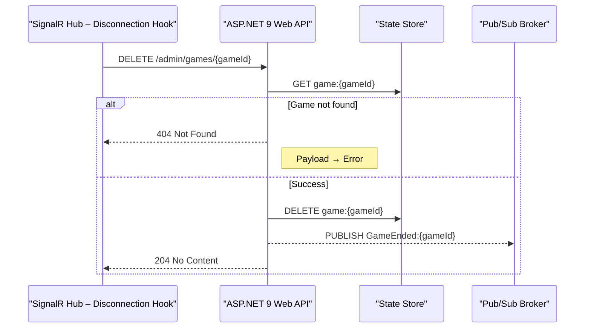
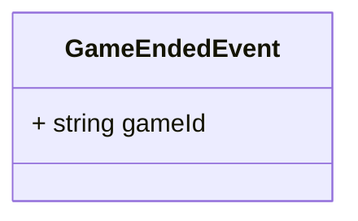

```mermaid
sequenceDiagram
  participant SignalR as "SignalR Hub – Disconnection Hook"
  participant API as "ASP.NET 9 Web API"
  participant Store as "State Store"
  participant PubSub as "Pub/Sub Broker"

  SignalR->>API: DELETE /admin/games/{gameId}
  API->>Store: GET game:{gameId}

  alt Game not found
    API-->>SignalR: 404 Not Found  
    Note right of API: Payload → Error
  else Success
    API->>Store: DELETE game:{gameId}
    API-->>PubSub: PUBLISH GameEnded:{gameId}
    API-->>SignalR: 204 No Content
  end
```

## Publish - GameEnded

```mermaid
classDiagram
    class GameEndedEvent {
      + string gameId
    }
```
