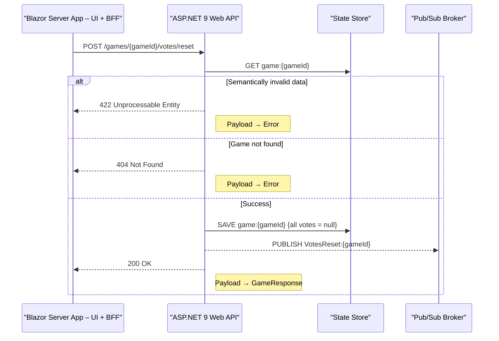
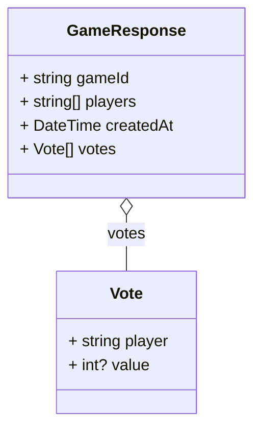
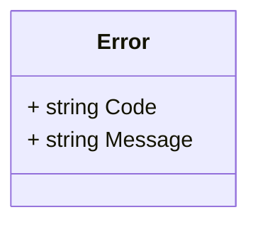
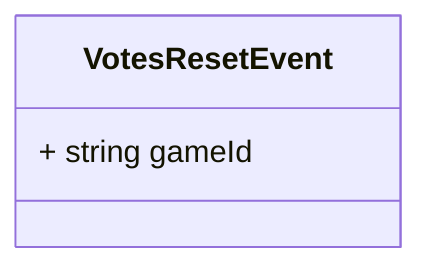

```mermaid
sequenceDiagram
  participant BFF as "Blazor Server App – UI + BFF"
  participant API as "ASP.NET 9 Web API"
  participant Store as "State Store"
  participant PubSub as "Pub/Sub Broker"

  BFF->>API: POST /games/{gameId}/votes/reset
  API->>Store: GET game:{gameId}

  alt Semantically invalid data  
    API-->>BFF: 422 Unprocessable Entity  
    Note right of API: Payload → Error  
  else Game not found  
    API-->>BFF: 404 Not Found  
    Note right of API: Payload → Error  
  else Success  
    API->>Store: SAVE game:{gameId} {all votes = null}  
    API-->>PubSub: PUBLISH VotesReset:{gameId}  
    API-->>BFF: 200 OK  
    Note right of API: Payload → GameResponse  
  end
```

---

## Response

```mermaid
classDiagram
    class GameResponse {
      + string gameId
      + string[] players
      + DateTime createdAt
      + Vote[] votes
    }
    class Vote {
      + string player
      + int? value
    }

    GameResponse o-- Vote : votes
```

---

## Error

```mermaid
classDiagram
    class Error {
      + string Code
      + string Message
    }
```

---

## Publish - VotesReset

```mermaid
classDiagram
    class VotesResetEvent {
      + string gameId
    }
```
